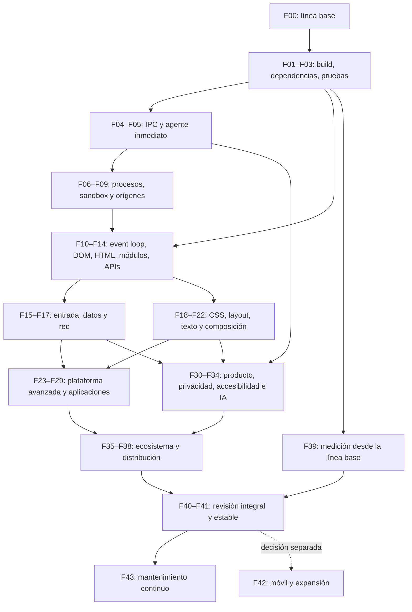

# Plan maestro de Navegador IA y de su motor web

**Revisión:** 21 de septiembre de 2026.

**Código analizado:** `888a62593ad46c36cb2b518edb00251d8c0e5f9e`.

**Rama local:** `fix/paginas-vacias-y-rendimiento`.

**Objetivo:** convertir el prototipo actual en un navegador seguro, compatible y mantenible, desarrollar su motor propio y demostrar ventajas concretas frente a Google Chrome.

**Alcance de esta entrega:** análisis y planificación; no se han implementado las correcciones descritas.

**Plan anterior conservado íntegramente:** [plan del 09-09-2026](docs/plans/plan-2026-09-09.md).

## Índice

1. [Diagnóstico y evidencias](#1-diagnóstico-y-evidencias)
2. [Qué significa superar a Chrome](#2-qué-significa-superar-a-chrome)
3. [Arquitectura objetivo y reglas de desarrollo](#3-arquitectura-objetivo-y-reglas-de-desarrollo)
4. [Fases de ejecución](#4-fases-de-ejecución)
5. [Dependencias e hitos de entrega](#5-dependencias-e-hitos-de-entrega)
6. [Validación, presupuestos y comparación](#6-validación-presupuestos-y-comparación)
7. [Organización y capacidad de trabajo](#7-organización-y-capacidad-de-trabajo)
8. [Riesgos y decisiones de arquitectura](#8-riesgos-y-decisiones-de-arquitectura)
9. [Primer backlog ejecutable](#9-primer-backlog-ejecutable)
10. [Correspondencia con el plan anterior](#10-correspondencia-con-el-plan-anterior)
11. [Comandos y evidencias de cierre](#11-comandos-y-evidencias-de-cierre)
12. [Referencias técnicas](#12-referencias-técnicas)

## 1. Diagnóstico y evidencias

### 1.1 Dictamen

El proyecto es un **prototipo funcional de navegador con motor propio**, con trabajo sustancial ya realizado. Tiene parsers reales, ejecución de JavaScript mediante Boa, layout, rasterizado, red HTTPS, pestañas, formularios e integración con una interfaz de escritorio. No hay que empezar desde cero.

Todavía no es un navegador de uso general ni hay evidencias para afirmar que supera a Chrome. La distancia principal está en aislamiento de contenido hostil, semántica de plataforma web, representación visual, integración completa del producto y mantenimiento. Pasar los tests internos demuestra que los comportamientos cubiertos siguen funcionando; no demuestra compatibilidad general ni seguridad suficiente.

Hay que separar tres productos técnicos:

- **Motor web:** carga documentos, aplica políticas, ejecuta scripts y produce píxeles y accesibilidad.
- **Navegador:** ventanas, pestañas, perfiles, permisos, historial, descargas, actualizaciones y experiencia de usuario.
- **Agente IA:** observa páginas y propone o ejecuta acciones dentro de capacidades autorizadas.

Cada uno necesita pruebas y criterios de aceptación propios. Una interfaz atractiva no resuelve un fallo de origen; añadir APIs no resuelve una actualización insegura; un resultado correcto del modelo no demuestra que se haya ejecutado la acción.

### 1.2 Qué se ha revisado

Se han inspeccionado el árbol versionado, los manifiestos y lockfiles, los workflows, el plan anterior, el backlog del motor, secciones de arquitectura y los caminos principales de Electron, React, agente, servidor Rust, protocolo, scripting, red, tipografía y pruebas. Se han ejecutado las comprobaciones indicadas abajo y dos reproducciones adicionales contra binarios reales.

No se ha hecho una auditoría exhaustiva de cada línea, una revisión criptográfica ni una evaluación visual completa de sitios. Tampoco se han probado instaladores, Linux, macOS, sesiones con credenciales reales, proveedores de IA ni Chrome en esta revisión. El estado remoto de GitHub, sus protecciones de rama y sus releases no se ha consultado: no se presume que esté igual que en el plan anterior.

El árbol Git estaba limpio al comenzar. Las compilaciones generan artefactos locales ignorados. La entrega documental modifica este plan y conserva una copia histórica del anterior.

### 1.3 Resultados medidos en esta revisión

Entorno: Windows, PowerShell, Node `24.14.0`, npm `11.9.0`, Cargo y rustc `1.98.0`.

| Comprobación | Resultado observado | Interpretación |
|---|---|---|
| `cargo test --workspace --locked` | **874 aprobados, 0 fallidos, 0 ignorados** | Incluye tests unitarios e integración; no son 874 WPT oficiales |
| `cargo clippy --workspace --all-targets --locked -- -D warnings` | Aprobado | Se mantienen las excepciones declaradas en `Cargo.toml` |
| Binario `wpt_runner` sobre `tests/wpt-style` | **60 aprobados, 0 fallidos** | Seis documentos locales; suite escrita en el proyecto |
| `cargo test -p engine-core --test api_probe --locked -- --nocapture` | **85/114** | 29 comprobaciones de la sonda no satisfechas; no mide todo el estándar |
| `npm run build` en `frontend` | Aprobado | TypeScript y bundle Vite compilados |
| `npm run lint:ci` | Aprobado con **20 hallazgos** | La puerta tolera la deuda registrada |
| `npm run lint` | **18 errores y 2 advertencias** | El lint estricto sigue fallando |
| `npm audit --json` en `desktop` | **13 entradas afectadas: 12 altas y 1 crítica** | Conteo por paquetes del informe, no 13 fallos independientes explotables |
| `npm audit --json` en `frontend` | **5 entradas: 4 altas y 1 moderada** | Requiere separar herramientas de compilación y código distribuido |
| `cargo audit --version` | Herramienta no instalada | No se ha ejecutado una auditoría Rust actualizada localmente |
| Fixture con excepción antes de `test(...)` | `wpt_runner` devuelve **0** y `0/0` | Falso éxito reproducido del ejecutor |
| Página local con `setTimeout` que cambia el título | `ANTES` → `DESPUES`; **0 mensajes espontáneos de estado** durante la observación | La mutación existe al pedir `get_state`, pero no llega sola al consumidor |

Los informes npm corresponden a los lockfiles y a la base de avisos consultada el día de la revisión. No equivalen a una prueba de explotación. El paquete `tar` concentra la severidad crítica en el árbol de herramientas de escritorio; `electron` también aparece afectado. Aunque Electron se declare como dependencia de desarrollo, su runtime se distribuye con la aplicación: `--omit=dev` por sí solo no audita el producto final.

Versiones fijadas observadas: Electron `30.5.1`, electron-builder `24.13.3`, Vite `8.0.16`, TypeScript `5.9.3`, React `19.2.7`; el manifiesto del motor declara Boa `0.19`. Se elegirán versiones de destino mantenidas al ejecutar la migración, sin congelar aquí una supuesta versión «última».

Inventario orientativo de archivos versionados: **10 crates**, **68 archivos Rust**, unas **36.546 líneas físicas Rust** contando comentarios, tests y separadores. Esta cifra no es tamaño de implementación productiva ni una medida de madurez.

### 1.4 Arquitectura actual

```text
Interfaz local React/Vite, dibujada por Electron
       │ API expuesta por preload
       ▼
Proceso principal Electron
       │ JSON por stdin/stdout; correlación de solicitudes
       ▼
engine_server: un proceso para todas las pestañas
       ├─ net: HTTP/1.1, TLS, cookies, CORS, CSP, almacenamiento
       ├─ dom: html5ever y árbol mutable
       ├─ css + layout: cascada y construcción de cajas
       ├─ js: Boa, bindings y temporizadores
       ├─ text + image + gfx: fuentes, imágenes y rasterizado
       └─ ai: árbol semántico y representación para el agente
       │ PNG completo codificado en Base64 + metadatos
       ▼
Viewport de la interfaz

Ruta alternativa de desarrollo:
React en navegador → WebSocket local → FastAPI → motor Rust
```

**Precisión importante:** las páginas visitadas se procesan con el motor Rust, pero la interfaz se ejecuta en Electron, que incorpora Chromium. «Motor de páginas propio» describe el diseño; «el producto no contiene Chromium» no lo describe. Sustituir la carcasa Electron es una decisión independiente de sustituir el motor de páginas.

### 1.5 Estado por subsistema

| Subsistema | Base existente | Trabajo que sigue siendo necesario |
|---|---|---|
| Red | HTTPS con rustls, redirecciones, compresión y políticas implementadas | Límites, cancelación, revisión de políticas, caché, streaming, HTTP/2 y después HTTP/3 |
| HTML/DOM | html5ever, mutaciones, bindings y jerarquía de clases | Identidad y colecciones vivas, namespaces, fragmentos en contexto, parser coordinado con scripts |
| JavaScript | Boa, promesas, módulos precargados, APIs parciales | Global de ventana, event loop completo, cargas de módulos, APIs web y conformance |
| CSS | Parsers y selectores reutilizados, cascada, varias propiedades | Valores tipados, pseudo-elementos, estados de interacción, cascada moderna |
| Layout | Bloques, inline y soporte parcial de flex/grid/tablas/posición | Cobertura semántica, texto complejo, geometría sincronizada e invalidación |
| Gráficos | tiny-skia, SVG y código GPU en el repositorio | El camino de escritorio sigue enviando PNG; composición y presentación eficientes pendientes |
| Pestañas | Estado e historial por pestaña | Un proceso compartido, recuperación, sesiones durables y aislamiento de sitios |
| Accesibilidad | AOM interno | No acredita UI Automation, VoiceOver o AT-SPI; selección y edición siguen incompletas |
| IA | Simulación y Gemini, límite de pasos, AOM opcional en interfaz de tipos | Credenciales, cancelación real, permisos, conexión efectiva del AOM y comprobación de resultados |
| Distribución | Configuración y scripts de empaquetado | Artefacto integral probado, dependencias mantenidas, firma y actualización verificadas |
| Calidad | Tests, CI, sonda y lint con límite | Fallos del harness, WPT oficiales, Test262, E2E de escritorio y pruebas de seguridad |

### 1.6 Hallazgos que deben convertirse en trabajo

Los estados distinguen **reproducido**, **confirmado en código** y **pendiente de validar**. P0 bloquea exposición general o la fiabilidad de la validación; P1 bloquea un uso cotidiano razonable; P2 completa el producto; P3 es ampliación o investigación. La prioridad no sustituye las dependencias.

| ID | Hallazgo y evidencia | Estado | Prioridad | Fases |
|---|---|---|---|---|
| H01 | Todas las pestañas viven en `EngineServer`; `sandbox.rs` aplica mitigaciones de Windows y declara que no es sandbox | Confirmado | P0 | F06–F09 |
| H02 | Avisos npm y cinco excepciones Rust en `.github/workflows/engine.yml`; dos de fast-float corresponden a fallos de seguridad documentados | npm medido; Rust pendiente de reauditar | P0 | F02 |
| H03 | `wpt_runner.rs` ignora resultados de scripts y termina bien si no hubo tests | Reproducido con fixture temporal | P0 | F03 |
| H04 | `gemini_api_key` se persiste en `localStorage`; petición al proveedor desde el renderer | Confirmado en `AgentSidebar.tsx` y `AgentOrchestrator.ts` | P0 | F05, F34 |
| H05 | `ipcMain.handle('engine:request')` reenvía payload sin validación de esquema ni del emisor; faltan políticas explícitas de navegación de la carcasa | Confirmado; no explotación demostrada | P0 | F04 |
| H06 | `next_line()` y buffer stdout sin límite de trama; timeout Electron no cancela el trabajo del motor | Confirmado | P0 | F04, F06, F10 |
| H07 | Tick de 250 ms modifica la pestaña activa y hace relayout, pero la rama de tick no escribe un estado a stdout | **Resuelto** (Fase 50): publicación `state` con `id: null`, deduplicada | P1 | F10, F22 |
| H08 | `window !== globalThis`, globals cortos ausentes | Reproducido por sonda | P1 | F11 |
| H09 | `el.append/prepend` falla en la sonda aunque existe implementación y se anuncia como conseguido | **Resuelto** (Fase 49): faltaba la interfaz `Node` (`childNodes`, `parentNode`, `firstChild`...) | P1 | F03, F11 |
| H10 | `modules.rs` ignora `_referrer`, usa base del documento y fuentes previamente descargadas | Confirmado | P1 | F13 |
| H11 | Métodos en instancias DOM; `dataset` snapshot; algunas colecciones y wrappers tienen simplificaciones | Confirmado parcial; inventario completo pendiente | P1 | F11 |
| H12 | XHR se implementa de forma síncrona incluso para la forma asíncrona | Confirmado en código y backlog | P1 | F10, F14 |
| H13 | `get_state` rasteriza PNG completo/Base64; relayout reconstruye el árbol | Confirmado | P1 | F19, F21, F22 |
| H14 | `getAccessibilityPrompt` es opcional en el orquestador, pero `App.tsx` no lo proporciona | Confirmado | P1 | F34 |
| H15 | `sendCommand` muestra errores y no los propaga; el agente puede continuar tras un comando fallido | **Resuelto** (Fase 52); falta E2E con Electron | P1 | F05, F30, F34 |
| H16 | «Detener» cambia una bandera, pero no aborta la petición del modelo ni impide una acción decidida por el paso en curso | **Resuelto** (Fase 51), con test de respuesta tardía | P0 | F05 |
| H17 | Escritura del agente usa `press_enter: true` desde `App.tsx` y puede enviar el formulario al rellenarlo | **Resuelto** (Fase 51): enviar es un paso explícito | P0 | F05, F15 |
| H18 | Python es opcional al arrancar Electron, pero `build-app.js` exige compilarlo con PyInstaller | Confirmado | P1 | F01 |
| H19 | CI de escritorio empaqueta con directorios de motor/backend vacíos | Confirmado | P1 | F01, F38 |
| H20 | 20 hallazgos de lint, entre ellos refs durante render, dependencias de hooks y uso de `any` | Reproducido | P1 | F01, F30 |
| H21 | `app://` usa comparación textual `absolutePath.startsWith(baseDir)` | Revisión defensiva necesaria; no se afirma traversal explotable | P0 | F04 |
| H22 | Backend opcional acepta WebSocket antes de una validación visible de origen/autenticación; CORS HTTP abierto | Confirmado en endpoint; exposición efectiva por validar | P0 si se habilita | F04 |
| H23 | Runtime nativo carece de reinicio supervisado equivalente al del backend Python | Confirmado en `desktop/main.js` | P1 | F06 |
| H24 | Selección de fuentes limitada al sans-serif de sistema y variantes | Confirmado en `text/src/font.rs` | P1 | F20 |
| H25 | No se han obtenido resultados de WPT oficial, Test262, benchmark comparativo o accesibilidad del SO | No evaluado | P1 | F03, F32, F39, F40 |

Las mitigaciones de Windows tienen valor, pero no eliminan acceso a archivos, red y datos del usuario. Rust reduce determinadas clases de fallos; no justifica afirmar que elimina toda corrupción de memoria, que no hay errores en dependencias o que desaparece un porcentaje fijo de vulnerabilidades del producto.

### 1.7 Documentación que hay que reconciliar

El plan anterior acumula cifras históricas como si fueran estado actual y mantiene listas de APIs ausentes que ya tienen implementación. El backlog también conserva ausencias que fases posteriores cerraron. No se debe copiar ese texto al nuevo código ni usarlo para decidir qué implementar sin verificarlo.

Casos concretos:

- El resultado actual de la sonda es 85/114; sus fallos no significan necesariamente que cada API carezca por completo de implementación.
- `document.readyState`, `activeElement`, `createDocumentFragment` y otras APIs aparecen como pendientes en pasajes antiguos pese a avances posteriores.
- El protocolo revisado contiene **16 variantes**; `SubmitForm` no está en el enum. La ausencia de ese comando no implica ausencia total de formularios: hay envío interno por interacción.
- Hay **seis** fixtures estilo WPT y 60 comprobaciones, frente a referencias históricas a cuatro fixtures y 24 pruebas.
- Existen targets de empaquetado Linux y macOS en `desktop/package.json`; lo pendiente es probarlos, no añadirlos como si no existieran.
- Hay un tick de temporizadores en segundo plano; comentarios anteriores que dicen que solo avanzan al recibir comandos están obsoletos.
- No se han verificado las afirmaciones previas sobre releases inexistentes o commits por delante de `main`.

La nueva regla de evidencia es: **comportamiento reproducido y código actual > informes fechados > narración histórica**. `ARCHITECTURE.md` conserva decisiones y evolución, pero necesita separar historia y estado vigente.

## 2. Qué significa superar a Chrome

### 2.1 Un objetivo comprobable

«Mejor que Chrome» se convierte en una matriz de resultados. No se promete ganar simultáneamente en todos los equipos, páginas, versiones o capacidades. El objetivo inicial es alcanzar una base segura y útil, y después demostrar ventajas en privacidad, consumo y productividad con IA sin ocultar incompatibilidades.

| Dimensión | Línea base actual | Objetivo propuesto | Cómo se demostrará |
|---|---|---|---|
| Compatibilidad | Sonda 85/114, sin WPT oficial | Corpus crítico completo y brecha decreciente frente a navegadores de referencia | WPT versionado, tareas reales y resultados por familia |
| Seguridad | Sin sandbox del renderer Rust | Aislamiento obligatorio, actualización segura y cero P0 abiertos | Tests negativos, revisión independiente y respuesta a incidentes |
| Memoria | Sin medición comparable | Aspiración: al menos 20% menos en corpus y hardware acordados | Suma de todos los procesos, misma funcionalidad, p50/p95 |
| Respuesta de interfaz | Sin línea base | Interacción fluida y menos bloqueos perceptibles | Latencia entrada→presentación, trazas y sesiones largas |
| Carga de páginas | Cifras históricas no revalidadas | Paridad primero; aspiración posterior de mejora ≥15% en corpus fijado | Frío/caliente, misma red y contenido, intervalos de confianza |
| Energía | Sin medición | Aspiración de mejora ≥15% en uso equivalente | Consumo total medido en equipos físicos |
| IA | Agente experimental | ≥90% de éxito en tareas autorizadas del corpus y cero acciones prohibidas en las pruebas | Éxito observable, presupuesto y pruebas adversarias |
| Privacidad | Sin aislamiento de perfiles completo | IA remota opt-in, mínimo dato enviado y borrado comprobable | Capturas de tráfico y pruebas de retención |
| Accesibilidad | AOM interno | Navegación y edición utilizables con teclado y lector de pantalla | Ensayos con tecnologías asistivas y usuarios |
| Fiabilidad | Tests internos en verde | Metas explícitas de sesiones sin caída y recuperación sin pérdida | Beta con consentimiento y reportes reproducibles |

Los porcentajes son **metas de producto propuestas**, no resultados ni estimaciones. Tras F39 se ratifican o ajustan mediante una decisión documentada; no se cambian después de medir para presentar un resultado favorable.

Un motor que consume menos por no ejecutar scripts, omitir imágenes o fallar al abrir una aplicación no ha ganado una comparación. Esos casos cuentan como fallos de compatibilidad.

### 2.2 Alcance del producto acabado

La primera versión estable se orienta a escritorio: navegación cotidiana, aplicaciones web del corpus, multimedia común, trabajo accesible, perfiles, datos persistentes, descargas, permisos, actualizaciones y agente opcional. No necesita implementar inmediatamente cada API experimental para ser útil, pero toda omisión debe estar registrada y no debe anunciarse como soporte.

Móvil, DRM comercial, compatibilidad universal con extensiones de Chrome y todas las políticas empresariales se tratan como programas separados. Se incluye su camino de decisión para no perderlos; no se oculta que pueden requerir acuerdos, especialistas o restricciones de plataforma.

«Terminar» significa aprobar los hitos de producto y disponer de mantenimiento sostenible. Los estándares, dependencias y ataques siguen evolucionando después de la versión 1.0.

## 3. Arquitectura objetivo y reglas de desarrollo

### 3.1 Separación de responsabilidades

```text
Interfaz del navegador ─── servicio de accesibilidad del SO
        │ contrato tipado; solo capacidades necesarias
        ▼
Broker confiable
  ├─ perfiles, permisos, sesiones y navegación
  ├─ supervisor de procesos y límites
  ├─ servicio de credenciales y proveedores IA
  ├─ servicio de red y almacenamiento particionado
  ├─ descargas y archivos elegidos por el usuario
  └─ actualizador y verificación de artefactos
        │ canales acotados; identidad y autorización por contexto
        ├─ renderer Rust A: DOM/CSS/JS/layout, sandbox
        ├─ renderer Rust B: DOM/CSS/JS/layout, sandbox
        ├─ workers: presupuesto y contexto de origen
        └─ servicios aislados de imagen/media/GPU cuando corresponda
                   │ superficies y regiones modificadas
                   ▼
             composición y presentación
```

La primera separación puede ser un proceso por pestaña. El destino necesita representar sitios, orígenes, frames y grupos de contextos: pestaña y frontera de seguridad no son conceptos equivalentes. Chromium documenta esta distinción en su [diseño de aislamiento de sitios](https://www.chromium.org/Home/chromium-security/site-isolation/).

El broker decide capacidades y valida cada operación. Un identificador difícil de adivinar no sustituye autorización. Los renderers no reciben las claves de IA, acceso arbitrario al perfil ni permiso de lanzar procesos.

### 3.2 Principios que se mantienen

1. El motor propio procesa las páginas. No se introduce un fallback silencioso a Chromium para aparentar compatibilidad.
2. Se reutilizan TLS, parsers, códecs y algoritmos complejos mantenidos cuando corresponda. «Propio» no significa reescribir toda dependencia.
3. Una API anunciada debe tener semántica observable, errores correctos y pruebas; no se registran stubs de éxito.
4. La IA no sustituye validaciones deterministas de seguridad ni corrige páginas ejecutando cambios arbitrarios sin autorización.
5. Las optimizaciones preservan resultado, aislamiento y accesibilidad.
6. Toda modificación funcional pequeña lleva una regresión relevante; no se generan tests que únicamente repitan el código.
7. Las funcionalidades sensibles o experimentales van tras flags desactivables; un fallo en la sandbox impide iniciar contenido no confiable.
8. Las decisiones costosas se documentan con alternativas, experimentos y salida reversible antes de una migración completa.

### 3.3 Decisiones que no conviene heredar como prohibiciones eternas

El plan anterior descartaba de forma permanente reconsiderar el runtime JS, una ruta de JIT o `window.open`. Para el objetivo ampliado conviene revisarlo con datos:

- Boa sigue siendo el punto de partida. La elección de runtime y eventual JIT se evaluará en F29; no se cambia ahora ni se presume que una sustitución vaya a resolver las APIs web.
- `window.open` debe tener activación de usuario, permisos y aislamiento adecuados. Bloquear todos los usos impediría ciertos flujos legítimos de autenticación.
- El AOM puede ahorrar contexto al modelo, pero el ahorro debe medirse; no se fija un «80%» sin corpus.
- No se delega multimedia en una webview con una sesión paralela sin definir cómo conserva origen, permisos, cookies y composición.
- Sustituir Electron se decide por coste total, memoria, accesibilidad y portabilidad, no por una etiqueta de marketing.

### 3.4 Formato de cada fase

Las fases nuevas se llaman **F00–F43**. Son identificadores de planificación, no sustituyen la numeración histórica de `ARCHITECTURE.md`, que ya llega a Fase 46.

Cada fase contiene objetivo, dependencias, archivos o componentes, tareas y una puerta de salida. Su estado inicial es pendiente salvo la inspección ejecutada en esta entrega. Las casillas no se marcan al escribir código: se marcan al aportar evidencia de aceptación.

## 4. Fases de ejecución

### F00 — Línea base fiable y decisiones de alcance

**Prioridad:** P0. **Depende de:** nada. **Resultado:** estado reproducible del proyecto y backlog sin contradicciones.

**Ámbito:** este plan, `README.md`, `engine/ARCHITECTURE.md`, `engine/huecos_sin_resolver.md`, inventario de dependencias y documentación nueva en `docs/`.

- [x] Inspeccionar la arquitectura y ejecutar las comprobaciones recogidas en 1.3.
- [x] Conservar el plan previo y establecer identificadores nuevos sin borrar la historia.
- [ ] Guardar informes estructurados asociados a commit, fecha, SO, compilador y comandos.
- [ ] Reconciliar capacidades declaradas contra código y pruebas; distinguir implementado, parcial, ausente y no verificado.
- [ ] Separar en arquitectura el estado vigente del relato de fases históricas.
- [ ] Definir usuarios iniciales, equipos de referencia y corpus crítico de tareas antes de comparar rendimiento.
- [ ] Verificar la relación real con `main`, estado del CI remoto y política de contribución antes de planear integración.
- [ ] Abrir un registro de decisiones para broker, runtime JS, almacenamiento, UI y modelo de extensiones.

**Aceptación:** un tercero identifica qué funciona, reproduce los resultados y localiza evidencia de cada capacidad sin reconciliar tres cifras incompatibles. No quedan afirmaciones de seguridad total o superioridad sin respaldo.

### F01 — Compilación reproducible y limpieza del producto

**Prioridad:** P0/P1. **Depende de:** F00. **Ámbito:** scripts raíz, `scripts/`, manifiestos, CI, frontend y backend opcional.

- [ ] Definir una ruta de instalación desde checkout limpio: dependencias, build del motor, frontend y arranque; el README actual omite pasos necesarios.
- [ ] Fijar toolchains compatibles y probar la versión mínima realmente soportada. Añadir `rust-version` y archivo de toolchain cuando estén verificados.
- [ ] Usar lockfiles y `npm ci` en validación; `--locked` también en la construcción de distribución.
- [ ] Hacer que el build del navegador normal no requiera Python. Documentar la ruta opcional web/FastAPI y evitar eliminarla antes de migrar sus usuarios o pruebas.
- [ ] Sustituir nombres de instaladores que contienen `1.0.0` fijo por valores derivados del manifiesto; alinear versiones y canal preestable.
- [ ] Resolver los 20 hallazgos de lint por grupos: tipado del protocolo, hooks/refs, efectos y organización de componentes.
- [ ] Mantener el límite de deuda decreciente durante la limpieza; después exigir cero errores y advertencias acordadas.
- [ ] Probar artefactos completos: el empaquetado con recursos vacíos no será la puerta de lanzamiento.
- [ ] Revisar scripts `.bat`/`.sh`, rutas con espacios y caracteres no ASCII; sustituir esperas fijas por comprobaciones de disponibilidad.
- [ ] Normalizar formato por lotes aislados y registrar cambios puramente mecánicos para conservar la utilidad del historial.

**Aceptación:** una máquina limpia compila e inicia la aplicación siguiendo instrucciones únicas, sin copiar binarios antiguos, sin backend obligatorio y con lint estricto aprobado. El build informa del commit y toolchain utilizados.

### F02 — Dependencias y cadena de suministro

**Prioridad:** P0. **Depende de:** línea base F00; puede avanzar junto a F01. **Ámbito:** Cargo/npm/Python, lockfiles y CI.

- [ ] Instalar en el entorno de auditoría herramientas versionadas para Rust y revisar el lockfile completo con una base de avisos actualizada.
- [ ] Clasificar cada aviso por dependencia, ruta, ejecución en build/runtime, entradas controlables y mitigación real.
- [ ] Migrar Electron y electron-builder a versiones mantenidas, revisando cambios de sandbox, preload, protocolos y actualización.
- [ ] Corregir avisos npm mediante actualización controlada; no ejecutar `audit fix --force` sin revisar el diff y los cambios incompatibles.
- [ ] Migrar Boa y su familia de crates a una versión compatible mantenida, o aplicar una solución upstream verificada que retire la ruta vulnerable; probar módulos, GC y bindings.
- [ ] Retirar excepciones resueltas. Las restantes tienen propietario, justificación técnica, fecha de revisión y condición de bloqueo de release.
- [ ] Generar SBOM del instalador, incluyendo runtime Electron y bibliotecas transitivas; incorporar revisión de licencias y avisos de terceros.
- [ ] Fijar acciones de CI por revisión verificable y reducir permisos de tokens; separar construcción sin secretos y publicación.
- [ ] Programar auditorías periódicas: una vulnerabilidad puede aparecer sin cambios en el código.

**Aceptación:** ningún aviso crítico/alto sin tratar en una ruta distribuida o en la cadena que produce el artefacto de release. Las excepciones no se convierten en una lista permanente. Tests, sonda y aplicación empaquetada siguen funcionando.

Los fallos de fast-float se documentan en [RUSTSEC-2025-0003](https://rustsec.org/advisories/RUSTSEC-2025-0003.html) y [RUSTSEC-2024-0379](https://rustsec.org/advisories/RUSTSEC-2024-0379.html). Esto confirma la naturaleza de esos avisos; no sustituye una nueva auditoría de todo el árbol.

### F03 — Pruebas que detecten fallos reales

**Prioridad:** P0. **Depende de:** F00. **Ámbito:** `wpt_runner.rs`, `test_harness.rs`, `api_probe.rs`, fixtures y CI.

- [x] Corregir el falso verde reproducido: excepción de script, error de carga del harness, fichero ilegible o ausencia inesperada de tests deben producir fallo diferenciado. *(23-09-2026, Fase 47 de `ARCHITECTURE.md`: `HARNESS-ERROR` por documento y código de salida 3; el fixture de 11.2 devuelve 3 y los seis fixtures siguen 60/60.)*
- [x] Separar estado del harness y resultados de subtests; `0/0` nunca cuenta como compatibilidad aprobada. *(Misma fase.)*
- [x] Añadir un proceso supervisor con timeout por documento, cierre del árbol de procesos y salida estructurada para crashes/hangs. *(23-09-2026, Fase 48: un proceso hijo por documento, `--timeout-ms`, estados `TIMEOUT`/`CRASH`; probado con un bucle infinito contra el binario real.)*
- [ ] Comparar identidades de tests, no solo la suma: un nuevo aprobado no puede esconder la regresión de otro caso.
- [x] Investigar el fallo `el.append/prepend` con fixture mínimo y comparación de mutación, identidad y colección; corregir implementación o sonda según la semántica observada. *(23-09-2026, Fase 49: `append` funcionaba; faltaba la interfaz `Node` entera, incluido `childNodes`. Implementada; sonda 86/114.)*
- [ ] Montar un primer adaptador para harness WPT oficial y servidores locales con HTTP, HTTPS y varios orígenes; fijar commit del corpus.
- [ ] Mantener expectations por test con motivo, responsable y estado; no editar un test upstream para adaptarlo al motor.
- [ ] Añadir formato JSON de resultados y conservación de stderr, timeout, semilla y revisión del ejecutable.
- [ ] Diseñar pruebas E2E separadas para motor y carcasa Electron; automatizar la carcasa no debe sustituir el motor Rust por el motor de la herramienta.

**Aceptación:** el fixture que hoy devuelve éxito con `0/0` pasa a fallo; un proceso colgado no bloquea el resto; la suite distingue regresión, no soportado, fallo de harness y timeout. Primer informe oficial limitado con denominador y exclusiones explícitos.

### F04 — Frontera segura de Electron e IPC

**Prioridad:** P0. **Depende de:** F01–F03 para validación. **Ámbito:** `desktop/main.js`, `preload.js`, `electron.d.ts`, protocolo Rust y frontend.

- [ ] Definir un esquema versionado de peticiones, respuestas y eventos; generar tipos compartidos o comprobar equivalencia automáticamente.
- [ ] Validar emisor, frame y origen de cada IPC privilegiado, además de payload, tamaño, tipo y valores finitos.
- [ ] Reducir la API de preload a capacidades explícitas; impedir que contenido de página obtenga el canal general del motor.
- [ ] Declarar y verificar sandbox de la carcasa, aislamiento de contexto, permisos y restricciones de nuevas ventanas/navegación.
- [ ] Incorporar CSP de la aplicación, fuentes locales y política de conexiones; quitar dependencias de Google Fonts en el arranque.
- [ ] Reescribir la resolución de recursos `app://` con parser de URL y comprobación de pertenencia de ruta, contemplando consultas, codificación, mayúsculas y separadores.
- [ ] Limitar líneas NDJSON, solicitudes pendientes, buffers y tamaño de imágenes; gestionar backpressure y Unicode fragmentado entre chunks.
- [ ] Tipar errores y propagar cancelación; una expiración de la promesa no equivale a detener una operación.
- [ ] Si se conserva FastAPI: validar origen WebSocket, autenticar la sesión local, limitar mensajes y probar conexiones desde páginas no autorizadas. CORS HTTP no protege un WebSocket.

**Aceptación:** mensajes malformados o de un emisor ajeno se rechazan; los límites evitan crecimiento ilimitado; no es posible leer recursos fuera de la raíz autorizada en el corpus de rutas; la carcasa no navega a contenido arbitrario.

La selección de controles se apoya en la [guía de seguridad de Electron](https://www.electronjs.org/docs/latest/tutorial/security). Su aplicación a la carcasa no protege automáticamente el proceso Rust independiente.

### F05 — Corregir inmediatamente las acciones del agente

**Prioridad:** P0. **Depende de:** contratos de F04; correcciones iniciales pueden empezar con F03. **Ámbito:** `AgentSidebar`, `AgentOrchestrator`, `App.tsx` y servicio privilegiado nuevo.

- [ ] Retirar claves de `localStorage` y del renderer; migrarlas una vez a almacenamiento protegido o pedir reintroducción, y borrar el valor anterior tras migración verificada.
- [ ] Mover peticiones de proveedor al servicio autorizado, con redacción de logs y sin devolver secretos al frontend.
- [x] Implementar identificador de ejecución y cancelación desde UI hasta proveedor y herramientas; comprobar cancelación también después de cada `await` y antes de actuar. *(23-09-2026, Fase 51: `AbortController` por ejecución hasta `fetch`, puntos de control y `AgentCancelledError`.)*
- [x] Cambiar rellenado para que no implique Enter/envío; enviar formularios será una acción distinta con política propia. *(Fase 51: `press_enter: false`; enviar es `press Enter`. La política propia de envío sigue pendiente con la autorización de acciones sensibles.)*
- [x] Hacer que errores del motor rechacen o devuelvan un resultado tipado de fallo; el agente no debe convertir una notificación visual en éxito. *(23-09-2026, Fase 52: `runEngineCommand` lanza `BrowserActionError`; `executeAction` devuelve `failed`.)*
- [x] Rechazar acciones desconocidas o respuestas malformadas del modelo. `else => acción completada` debe desaparecer. *(Fase 52; política decidida: el fallo vuelve al modelo y dos seguidos detienen la ejecución.)*
- [ ] Vincular acciones a pestaña, documento y revisión observada; al cambiar el usuario de pestaña se revalida o cancela el paso.
- [ ] Exigir autorización concreta para compras, envíos, borrados, publicación y revelación de datos; respetar autorizaciones previas sin preguntar en cada paso inocuo.
- [ ] Añadir pruebas de detener durante la petición, respuesta tardía, fallo del motor, campo desaparecido y doble ejecución. *(Fases 51-52: detener durante la petición, respuesta tardía, fallo del motor y campo desaparecido cubiertos con `npm test`; falta doble ejecución.)*

**Aceptación:** detener impide nuevas acciones pendientes; rellenar no envía; no hay claves en almacenamiento del renderer ni en logs; un fallo real se presenta como fallo y no como objetivo conseguido.

En Linux, el almacenamiento protegido debe comprobar la disponibilidad real de un almacén seguro; no basta con llamar a una API. La documentación de [safeStorage](https://www.electronjs.org/docs/latest/api/safe-storage) describe diferencias entre plataformas y backends.

### F06 — Broker y aislamiento inicial por procesos

**Prioridad:** P0. **Depende de:** F02–F04. **Ámbito:** `core/server.rs`, binarios del motor, servicios de red/datos y supervisor de escritorio.

- [ ] Extraer gestión de sesiones y pestañas de la ejecución de documentos; definir ownership de cada recurso antes de moverlo de proceso.
- [ ] Introducir broker y renderer por pestaña como primer paso, conservando contrato externo mientras evoluciona el interno.
- [ ] Añadir identificadores de contexto, documento y navegación; descartar respuestas de documentos destruidos.
- [ ] Mover acceso a red, perfil, cookies y archivos a servicios mediados. El renderer solicita capacidades, no rutas arbitrarias.
- [ ] Añadir watchdog fuera del proceso que ejecuta JS; una cola de promesas o bucle infinito no puede impedir que el supervisor intervenga.
- [ ] Hacer que cerrar pestaña cancele cargas, termine tareas y libere handles; probar caída, arranque fallido y proceso huérfano.
- [ ] Recuperar pestañas con página de fallo y recarga explícita, sin repetir automáticamente POST ni acciones del agente.
- [ ] Medir coste de arranque/RSS para dimensionar límites, sin reusar procesos entre fronteras incompatibles por ahorrar memoria.

**Aceptación:** un crash o bucle infinito deliberado en una pestaña no cierra ni bloquea las demás ni la interfaz; no sobreviven procesos al cierre; una petición tardía no modifica otra pestaña. Documentar qué aislamiento todavía no proporciona el proceso por pestaña.

### F07 — Sandbox efectiva del sistema operativo

**Prioridad:** P0. **Depende de:** F06. **Ámbito:** `sandbox.rs`, lanzador del broker y adaptadores de plataforma.

- [ ] Crear `engine/SECURITY.md` con activos, entradas hostiles, fronteras, privilegios y amenazas cubiertas/no cubiertas.
- [ ] Diseñar en Windows un proceso con token restringido/AppContainer según el prototipo elegido, límites de Job Object y lista mínima de handles heredados.
- [ ] Aplicar restricciones antes de recibir contenido: lectura del perfil, escritura en disco, red directa, creación de hijos y acceso a interfaces privilegiadas.
- [ ] Mantener las mitigaciones existentes y evaluar sus efectos sobre fuentes, GPU y un posible JIT; no relajarlas globalmente para resolver una incompatibilidad.
- [ ] Crear en Linux política equivalente basada en mecanismos disponibles y probar el modelo de distribución; resolver macOS con su modelo de sandbox y firma.
- [ ] Diseñar permisos de archivos como handles/capacidades obtenidos tras elección del usuario, nunca directorios completos por comodidad.
- [ ] Añadir pruebas negativas ejecutadas desde dentro del renderer: archivo privado, socket, proceso hijo, conexión al broker ajeno y recurso del otro perfil.
- [ ] Si la política no puede aplicarse, fallar de forma cerrada y mostrar el motivo; ningún fallback transparente al proceso sin restricciones.

**Aceptación:** las pruebas verifican denegación efectiva, no solo flags retornados. Revisión independiente antes de abrir una beta a navegación arbitraria. Cada SO distribuido necesita evidencia propia.

### F08 — Políticas de red y seguridad de recursos

**Prioridad:** P0. **Depende de:** F03–F04; mover la implementación al servicio diseñado en F06. **Ámbito:** `net/`, `fetch.rs`, `xhr.rs`, carga de subrecursos.

- [ ] Auditar cookies, CORS y CSP contra casos negativos y redirecciones; implementación existente no equivale a cobertura completa.
- [ ] Centralizar contexto de petición: origen iniciador, destino, modo, credenciales, redirect mode, referrer y partición de datos.
- [ ] Limitar bytes comprimidos/descomprimidos, cabeceras, tiempos, profundidad de redirección y dimensiones decodificadas.
- [ ] Revisar retirada de credenciales al cambiar origen, cookies HttpOnly/Secure/SameSite, sufijos públicos y prefijos de seguridad.
- [ ] Completar MIME, `nosniff`, mixed content, HSTS y Referrer-Policy; representar claramente errores de certificado y evitar bypasses silenciosos.
- [ ] Completar CSP según el subconjunto objetivo: fuentes, inline/nonces/hashes, navegación de formularios y frames cuando existan; añadir reportes útiles.
- [ ] Modelar contextos seguros, orígenes opacos y recursos `data:`/`blob:`/`file:` antes de habilitarlos ampliamente.
- [ ] Separar navegación humana a localhost de acceso de una página o agente a servicios privados; diseñar política explícita contra accesos no autorizados y DNS rebinding.
- [ ] Verificar que toda nueva vía de carga —módulo, fuente, worker, media— atraviesa la misma política.

**Aceptación:** matriz por API/esquema/origen con casos positivos y negativos; servidor local multi-origen demuestra que redirecciones y subrecursos no evaden controles. La base semántica de red se contrastará con el [Fetch Standard](https://fetch.spec.whatwg.org/).

### F09 — Modelo de origen, sitios y contextos de navegación

**Prioridad:** P0 para beta pública. **Depende de:** F06–F08, diseño de F11. **Ámbito:** broker, navegación, DOM global y políticas de datos.

- [ ] Crear tipos diferentes para URL, origen, sitio, clave de almacenamiento y grupo de contextos; evitar comparaciones ad hoc de strings.
- [ ] Diseñar cambio de proceso al navegar entre fronteras de aislamiento y transferencia segura de navegación pendiente.
- [ ] Implementar modelo de frame y relaciones parent/opener con control de acceso incluso si dos documentos comparten proceso.
- [ ] Incorporar aislamiento de subframes de otros sitios, restricciones de opener y políticas COOP/COEP/CORP donde corresponda.
- [ ] Particionar cookies, almacenamiento y cachés donde la política de privacidad lo requiera; no confundir partición con mero directorio por dominio.
- [ ] Impedir que mensajes y referencias sobrevivan como capacidades válidas después de navegar o destruir un contexto.
- [ ] Probar orígenes opacos, puertos, subdominios, redirecciones y esquemas internos con una matriz compartida entre red, DOM y agente.

**Aceptación:** las relaciones de navegación no permiten leer DOM/datos ajenos; sitios aislados no comparten renderer indebidamente; el historial y la apertura legítima de ventanas siguen funcionando. UUIDs no se contabilizan como cumplimiento de esta fase.

### F10 — Event loop, cancelación y actualización de pantalla

**Prioridad:** P1, con límites anti-bloqueo P0. **Depende de:** F03–F04; integración con F06. **Ámbito:** `runtime.rs`, `event_loop.rs`, `timers.rs`, `server.rs` y transporte de estados.

- [x] Corregir primero H07: cuando el temporizador cambia contenido visible, publicar invalidación/estado que llegue a la UI sin clic ni sondeo manual. *(23-09-2026, Fase 50: `state` con `id: null` deduplicado por huella; clientes Python y de tests correlacionan por `id`.)*
- [ ] Sustituir el tick fijo como mecanismo central por planificación de tareas, microtareas, red y oportunidad de renderizado.
- [ ] Evitar que `handle(...).await` monopolice la atención de mensajes durante una navegación; permitir cancelar, cerrar o cambiar pestaña.
- [ ] Integrar I/O con el hilo dueño de Boa sin compartir objetos no `Send` de forma insegura ni bloquear con esperas síncronas.
- [ ] Separar colas de tarea y drenado de microtareas; cubrir orden, rechazo de promesas y errores sin ocultarlos.
- [ ] Sincronizar rAF con presentación y visibilidad; limitar trabajo en background sin impedir funcionalidades necesarias.
- [ ] Propagar abortos reales hasta DNS/conexión/cuerpo/decodificación cuando sea posible; liberar recursos y reportar resultado consistente.
- [ ] Añadir presupuesto de ejecución y watchdog externo; un timeout de Tokio no interrumpe por sí solo un bucle síncrono de JS.
- [ ] Probar dos pestañas, temporizadores, input y red lenta simultáneos, incluyendo cierre durante callback.

**Aceptación:** un reloj de página se actualiza visualmente sin interacción; no hay 250 ms de latencia mínima impuesta a animaciones; cancelar no deja descargas activas sin dueño; los tests de orden y respuesta del broker pasan. El modelo se contrastará con [event loops de HTML](https://html.spec.whatwg.org/multipage/webappapis.html#event-loops).

### F11 — Identidad DOM, bindings y ventana global

**Prioridad:** P1. **Depende de:** F02–F03 y contratos de F10. **Ámbito:** `dom_bindings.rs`, `dom_classes.rs`, `window.rs`, `node.rs`, `cssom.rs`.

- [ ] Resolver `window`, `self`, `globalThis` y exposición de globals con semántica de Window/WindowProxy; no parchear únicamente tres aliases.
- [ ] Establecer identidad estable de wrappers por nodo y realm, incluyendo referencias obtenidas por APIs diferentes.
- [ ] Mover métodos a prototipos y obtener nodo desde `this`; implementar comprobaciones de receptor y descriptores adecuados.
- [ ] Diseñar la relación GC de Boa ↔ árbol Rust, raíces, nodos desconectados y listeners; probar liberación y evitar punteros vivos tras destrucción.
- [ ] Corregir `append/prepend` y colecciones según el resultado de la reproducción: distinguir colecciones vivas de resultados estáticos.
- [ ] Completar atributos y propiedades reflejadas, `dataset` vivo, `NodeList`, `HTMLCollection`, iteradores y mutaciones sin snapshots engañosos.
- [ ] Añadir operaciones de Node/Element/Document pendientes: reemplazo, inserción, adopción, importación, normalización y orden documental.
- [ ] Completar geometría, foco y estilos usados con reglas de sincronización; una lectura de medida debe ver mutaciones previas cuando corresponda.
- [ ] Evaluar una capa WebIDL/generación de bindings para reducir implementaciones manuales inconsistentes, empezando por un conjunto pequeño.

**Aceptación:** casos de identidad, prototipos, polyfills, `call` con receptor incorrecto, colecciones tras mutación y destrucción de documentos pasan; la sonda mejora sin perder casos ya aprobados.

### F12 — HTML completo y coordinación del parser

**Prioridad:** P1. **Depende de:** F10–F11, streaming inicial de F17. **Ámbito:** `parser.rs`, `html5ever_sink.rs`, `scripting.rs`, pipeline.

- [ ] Conservar namespaces y nombres de SVG/MathML, doctype, modo quirks y propiedades de documento relevantes.
- [ ] Implementar contenido inerte de `<template>` y fragmentos en contexto real, incluyendo tablas y elementos de texto especial.
- [ ] Integrar pausas del parser por scripts clásicos y continuación del documento; cubrir `document.write` de forma compatible y acotada.
- [ ] Actualizar `readyState`, `currentScript`, DOMContentLoaded y load a partir del ciclo real, no valores aproximados permanentes.
- [ ] Preservar orden de `<style>` y `<link>` en cascada; verificar el efecto de estilos y scripts insertados dinámicamente.
- [ ] Añadir DOMParser y serialización semánticamente correcta; fidelidad de bytes al fuente no es requisito del serializador DOM.
- [ ] Cubrir `<base>`, codificaciones, BOM, metadatos y cambios de base permitidos con fixtures difíciles.
- [ ] Limitar profundidad/tamaño y fuzzear el adaptador propio de html5ever, no asumir que reutilizar el parser valida el TreeSink.

**Aceptación:** corpus de parseo y serialización sin diferencias no justificadas; scripts observan el DOM disponible en su momento; namespaces y templates funcionan en librerías del corpus. No se reescribe html5ever sin necesidad demostrada.

### F13 — Módulos y carga de scripts moderna

**Prioridad:** P1. **Depende de:** F08, F10–F12. **Ámbito:** `modules.rs`, `scripting.rs`, descubrimiento/carga de recursos.

- [ ] Resolver especificadores contra el módulo importador; conservar URL canónica y metadatos por módulo.
- [ ] Descargar el grafo transitivo bajo política de red, incluso si no aparece en `modulepreload`.
- [ ] Implementar `import()` dinámico con promesa, caché, cancelación y errores adecuados.
- [ ] Implementar import maps, bare specifiers y resolución de scopes; invalidar supuestos actuales basados únicamente en rutas de bundler.
- [ ] Cubrir ciclos, live bindings, evaluación única, errores de enlace y top-level await si la versión del runtime lo soporta conforme al objetivo.
- [ ] Implementar `import.meta` y revisar MIME/CORS de módulos, incluidas redirecciones.
- [ ] Ejecutar `async` según disponibilidad real y `defer` en su secuencia; manejar inserción dinámica de scripts.
- [ ] Añadir fixtures con dependencias en subdirectorios, chunks no precargados, errores 404, cambios de origen y navegación cancelada.

**Aceptación:** aplicaciones compiladas sin hacks específicos de sus nombres de archivo cargan y navegan entre rutas; un módulo se evalúa una sola vez por mapa; se informa de la URL y causa exacta al fallar.

### F14 — APIs básicas de plataforma web

**Prioridad:** P1. **Depende de:** F08, F10–F11. **Ámbito:** `platform.rs`, `fetch.rs`, `xhr.rs`, objetos nuevos y harness.

- [ ] Implementar Headers, Request y Response con cuerpos, consumo único, clonación y errores; convertir fetch en una API coherente sobre el servicio de red.
- [ ] Añadir AbortController/AbortSignal conectados a cancelación real, no solo una bandera visible.
- [ ] Implementar Blob, File, FormData y streams con backpressure, límites y ownership; los permisos de archivos siguen en el broker.
- [ ] Corregir TextEncoder/Decoder para tipos binarios y opciones pertinentes; probar Unicode inválido y límites de buffers.
- [ ] Añadir `structuredClone` con ciclos, tipos soportados y transferencias; rechazar explícitamente valores no clonables.
- [ ] Incorporar aleatoriedad criptográfica y UUID mediante primitivas mantenidas; planificar WebCrypto sin inventar algoritmos.
- [ ] Habilitar y validar Intl según runtime/datos elegidos; documentar tamaño, actualizaciones y locale fallback.
- [ ] Implementar performance entries reales, eventos de error y rejection; instrumentación parcial no debe simular mediciones.
- [ ] Convertir XHR asíncrono en ejecución realmente asíncrona con readyState, abort, timeout y responseType.

**Aceptación:** las APIs funcionan como conjunto en casos de streaming, cancelación, clones y datos binarios; el estado y orden de eventos coinciden con casos de referencia. La sonda de existencia se acompaña de pruebas semánticas.

### F15 — Entrada, edición, formularios y selección

**Prioridad:** P1. **Depende de:** F10–F14. **Ámbito:** servidor, protocolo de input, bindings y viewport.

- [ ] Modelar eventos reales de ratón, pointer, teclado, rueda y foco con coordenadas, botones, modificadores, composición e identificadores.
- [ ] Implementar EventTarget construible, fases, composedPath y acción por defecto; distinguir eventos sintéticos de entrada confiable.
- [ ] Añadir foco por teclado, orden Tab, focus-visible, captura de puntero y estados CSS sincronizados.
- [ ] Completar controles `<details>`, `<summary>`, `<dialog>`, `<progress>` y `<meter>` con estados, eventos, foco y representación accesible. Enrutar alert/confirm/prompt a diálogos de UI sin congelar otras pestañas ni permitir suplantación del origen.
- [ ] Implementar caret, selección, rangos, copiar/cortar/pegar, deshacer y edición de texto; añadir IME para español, CJK y teclas muertas.
- [ ] Completar formularios: requestSubmit frente a submit, validación, submitter, reset, controles asociados y multipart.
- [ ] Incorporar selectores de archivo/color/fecha y controles accesibles; no convertir una ruta de archivo recibida por JS en permiso.
- [ ] Añadir comando de envío si lo necesita el broker/agente, con identidad de formulario y resultado; evitar duplicar la lógica de envío del motor.
- [ ] Implementar contenteditable y editores del corpus por etapas con semántica documentada.
- [ ] Cubrir zoom, DPI, scroll y transformaciones en hit-testing y selección.

**Aceptación:** una persona rellena, corrige, selecciona y envía formularios con teclado o ratón; el agente distingue escribir/enviar; un editor de prueba funciona con IME y conserva selección tras cambios del DOM.

### F16 — Almacenamiento web y persistencia transaccional

**Prioridad:** P1. **Depende de:** F06, F08–F11, F14. **Ámbito:** `net/storage.rs`, `js/storage.rs`, perfiles y base de datos nueva.

- [ ] Separar almacenamiento de navegador y almacenamiento accesible a páginas, con claves de partición y cuotas explícitas.
- [ ] Completar semántica de Storage: acceso por propiedad, eventos, sessionStorage y aislamiento de ventanas/perfiles.
- [ ] Añadir IndexedDB incrementalmente: claves, object stores, índices, transacciones, upgrade, cursores y recuperación.
- [ ] Diseñar operaciones atómicas, migraciones de esquema, journaling y tolerancia a cierre durante escritura.
- [ ] Implementar Cache Storage con reglas de origen y cuotas como dependencia de Service Workers.
- [ ] Incorporar estimación de uso, evicción predecible y borrado por sitio; no eliminar datos activos de forma arbitraria.
- [ ] Probar modo privado sin persistencia accidental en cookies, cachés, logs o archivos temporales.
- [ ] Revisar permisos de directorios, corrupción de archivos y tamaño máximo; no confiar en archivos del perfil como datos bien formados.

**Aceptación:** aplicaciones locales guardan datos y los recuperan tras reiniciar; transacciones interrumpidas no dejan estados parciales; borrar un sitio y cerrar un perfil privado elimina lo especificado y no afecta a otros perfiles.

### F17 — Red eficiente, caché y carga progresiva

**Prioridad:** P1. **Depende de:** F08; coordinación con F10, F12 y F16. **Ámbito:** `http_client.rs`, servicio de red y pipeline.

- [ ] Añadir métricas de DNS, conexión, TLS, primer byte, bytes, caché y decodificación antes de optimizar.
- [ ] Implementar caché de memoria/disco con revalidación, ETag, Last-Modified, Cache-Control, Vary y partición; cubrir `no-store` y respuestas autenticadas.
- [ ] Incorporar HTTP/2 y negociación ALPN con pruebas de fallback, multiplexado y cancelación de streams.
- [ ] Implementar streaming del cuerpo y parseo progresivo con límites; presentar contenido antes de descargar todo cuando sea válido.
- [ ] Implementar carga recursiva de `@import`, resolución de URLs relativa a cada CSS y detección de ciclos.
- [ ] Añadir prioridades, preload/modulepreload, caché de preflight y reuso de conexiones medido; evitar precargas que filtren actividad sin política.
- [ ] Integrar proxy del SO, PAC si entra en alcance, errores offline y cambios de conectividad; no asumir red directa permanente.
- [ ] Evaluar HTTP/3 con biblioteca mantenida después de estabilizar caché y HTTP/2; incluir métricas y fallback.
- [ ] Incorporar formatos de compresión adicionales solo tras revisar límites y beneficio, sin asumir que una decisión histórica sigue vigente.

**Aceptación:** recargas condicionadas transfieren menos bytes de forma verificable; contenido `no-store` no reaparece desde disco; una carga lenta permite interacción/cancelación; mejorar tiempos no empeora políticas de red.

### F18 — CSS: valores, cascada y estados

**Prioridad:** P1. **Depende de:** F03, F11–F12. **Ámbito:** `css/`, estilos calculados y adaptación de selectores.

- [ ] Inventariar propiedades por parseo, valor calculado, layout y pintura; «se parsea» no significa «se soporta».
- [ ] Introducir valores tipados para longitudes, porcentajes, colores y expresiones; evaluar calc/min/max/clamp en la etapa con información suficiente.
- [ ] Completar cascada: herencia, important, capas, origen de usuario, variables, fallbacks y ciclos; verificar orden de hojas externas/inline.
- [ ] Implementar pseudo-elementos before/after/marker/placeholder y contenido generado, integrados en layout y accesibilidad.
- [ ] Conectar hover/focus/active/focus-within a invalidación real; definir privacidad de visited sin exponer historial mediante lecturas.
- [ ] Cubrir selectores pendientes, incluidos casos de `:has`, con invalidación asociada y límites de coste.
- [ ] Añadir container queries, nesting y registro de custom properties por etapas tras asegurar valores y dependencias.
- [ ] Implementar colores modernos, gradientes y fondos multicapa junto a pintura; mantener CSS.supports coherente con capacidades reales.

**Aceptación:** reftests y casos de cascada muestran el resultado esperado; no hay aceptación silenciosa que termine en cero arbitrario; cambiar un estado de interacción modifica el estilo y la zona correcta.

### F19 — Layout correcto e incremental

**Prioridad:** P1. **Depende de:** F11, F18; coordinar texto con F20. **Ámbito:** `layout/`, snapshots CSSOM y geometría.

- [ ] Caracterizar el soporte existente de bloques/inline/float/posición con casos de conformidad antes de extenderlo.
- [ ] Completar flex: tamaños intrínsecos, min/max, wrap, orden, baseline, gaps y alineación; auditar el adaptador de taffy.
- [ ] Completar grid: tracks implícitos, filas, auto-placement, repeat/minmax, spans, alineación y subgrid en una etapa posterior.
- [ ] Cubrir tablas, contenido reemplazado, aspect-ratio, object-fit, overflow y scroll anidado.
- [ ] Corregir containing blocks de fixed/absolute/sticky, margin collapsing y medidas dependientes del porcentaje.
- [ ] Añadir flags de suciedad de estilo/layout/pintura, dependencias y recomputación por subárbol con invalidación conservadora correcta.
- [ ] Implementar IntersectionObserver con umbrales, root/rootMargin, scroll y notificación inicial; ResizeObserver con cajas observadas, orden de entrega y protección frente a bucles. Desconexión y eliminación de nodos deben liberar observaciones.
- [ ] Sincronizar lecturas CSSOM que exigen layout; medir y hacer visible el coste de reflows forzados.
- [ ] Extender writing modes y fragmentación para impresión en coordinación con F20/F30.
- [ ] Añadir presupuestos para árboles profundos, cajas enormes y overflow numérico.

**Aceptación:** el corpus de layout es correcto y una mutación localizada no recorre innecesariamente todo el documento; objetivo inicial de p95 <50 ms para escenarios definidos de 10.000 nodos, a ratificar tras la línea base de rendimiento.

### F20 — Tipografía, idiomas y fuentes web

**Prioridad:** P1. **Depende de:** F08, F17–F19. **Ámbito:** `text/`, carga de fuentes y rasterizado.

- [ ] Respetar font-family, pesos/estilos reales y fallback por cobertura; sustituir la selección exclusiva sans-serif sin duplicar el descubrimiento de fuentes.
- [ ] Añadir `@font-face`, WOFF/WOFF2 y font-display con validación, caché y decodificación aislada cuando proceda.
- [ ] Cubrir shaping complejo, ligaduras, kerning, bidi, separación por grafemas y segmentación de líneas Unicode.
- [ ] Implementar white-space, word-break, overflow-wrap, letter/word spacing, text-transform y ellipsis.
- [ ] Añadir fuentes variables, emoji y fallback multilingüe según corpus, preservando correspondencia texto↔glifos para selección.
- [ ] Cachear shaping y medidas por claves completas: fuente, variaciones, tamaño, idioma, dirección y contenido.
- [ ] Revisar dependencias de tipografía señaladas como sin mantenimiento; elegir sustitución o mantenimiento sostenible con métricas.
- [ ] Usar fuentes de prueba redistribuibles fijadas para reftests; separar diferencias de rasterizado del SO de errores de geometría.

**Aceptación:** español, árabe/hebreo, CJK y emoji tienen lectura, cursor y selección coherentes; cambiar la fuente modifica medidas reales; las fuentes web respetan políticas de origen y límites.

### F21 — Pintura correcta y modelo de apilamiento

**Prioridad:** P1. **Depende de:** F18–F20. **Ámbito:** `gfx/display_list.rs`, `paint.rs`, `raster.rs`, imágenes y Canvas.

- [ ] Implementar stacking contexts, z-index, opacity, visibility y clipping con orden verificable.
- [ ] Añadir fondos multicapa, gradientes, repeat/size/position y propagación del fondo al canvas sin doble composición incorrecta.
- [ ] Implementar transforms 2D y después 3D, perspectiva y matriz inversa para hit-testing; cubrir elementos fuera del viewport.
- [ ] Completar borders, sombras, outline, masks y filtros por etapas con límites de superficie intermedia.
- [ ] Verificar SVG y Canvas 2D como APIs con estado, paths, transforms, composición y lectura de píxeles sujeta a origen.
- [ ] Añadir gestión de color, escalado, alpha premultiplicado y formatos de imagen con fixtures de referencia.
- [ ] Diferenciar árbol DOM, layout, display list y regiones interactivas; no aproximar clicks con cajas visuales obsoletas.
- [ ] Incorporar snapshots visuales y reftests con tolerancias localizadas, nunca una tolerancia global que oculte páginas incompletas.

**Aceptación:** transparencia, stacking y transforms coinciden con referencias; coordenadas visuales e interacción corresponden; leer canvas contaminado por recursos ajenos no filtra píxeles.

### F22 — Composición, animaciones y presentación eficiente

**Prioridad:** P1/P2. **Depende de:** F06, F10, F19–F21. **Ámbito:** GPU/compositor, protocolo de frames y viewport.

- [ ] Medir por separado rasterizado, PNG, Base64, IPC, decodificación y presentación en la ruta actual.
- [ ] Añadir IDs de frame y invalidación explícita; descartar fotogramas atrasados y mantener sincronía con hit-testing.
- [ ] Prototipar memoria compartida/superficies nativas y regiones sucias; validar ownership y límites antes de retirar la ruta PNG de diagnóstico.
- [ ] Incorporar composición por capas y scroll que no requiera repintar la página completa si su contenido no cambia.
- [ ] Implementar transitions, animations, keyframes y Web Animations con reloj común, estado de visibilidad y preferencias de movimiento reducido.
- [ ] Añadir tratamiento de pérdida de dispositivo, resize, suspensión del equipo y múltiples monitores/DPI.
- [ ] Limitar cuadros en vuelo para que un renderer no agote memoria ni bloquee la interfaz.
- [ ] Conservar una ruta software probada para equipos sin aceleración; no afirmar aceleración de escritorio solo por existir `wgpu` en dependencias.

**Aceptación:** scroll/animación sostenidos con métricas p95/p99, sin cola creciente de cuadros ni coste de PNG por cada evento; a 60 Hz se persigue presupuesto de 16,7 ms por cuadro, con rendimiento real informado por dispositivo.

### F23 — Workers, mensajería y ejecución en background

**Prioridad:** P2, necesario para aplicaciones modernas. **Depende de:** F07–F10, F13–F14, F16–F17.

- [ ] Implementar MessageChannel, MessagePort y structured clone con transferencias y cierre definido.
- [ ] Añadir Dedicated Workers con runtime propio, carga de scripts/módulos, terminación y presupuestos de recursos.
- [ ] Incorporar Shared Workers si el corpus lo requiere, respetando claves de origen y vida útil de clientes.
- [ ] Implementar Service Workers: registro, instalación, activación, actualización, alcance y control de clientes.
- [ ] Integrar fetch interception y Cache Storage sin saltarse políticas, cuotas ni separación de perfiles.
- [ ] Diseñar estados offline, terminación/reinicio y eventos pendientes sin mantener procesos ilimitados.
- [ ] Permitir SharedArrayBuffer/Atomics solo cuando estén resueltos requisitos de aislamiento y modelo de memoria; no habilitarlos globalmente.
- [ ] Crear herramientas para inspeccionar y desregistrar workers y borrar sus datos.

**Aceptación:** aplicación offline del corpus funciona tras reiniciar, un worker bloqueado se termina, y una actualización de SW no mezcla código/datos incompatibles ni afecta a otro origen.

### F24 — Frames, componentes web y ventanas relacionadas

**Prioridad:** P1/P2. **Depende de:** F09–F15, F18–F21. **Ámbito:** árbol de contextos, DOM y compositor.

- [ ] Implementar iframe con documento, origen, viewport y ciclo de vida propios; incluir lazy loading y eliminación durante navegación.
- [ ] Añadir postMessage con targetOrigin, source y validación al entregar; probar navegación entre envío y recepción.
- [ ] Implementar atributos sandbox y Permissions Policy según APIs disponibles; combinar correctamente restricciones heredadas.
- [ ] Añadir `window.open` controlado por activación/permiso y relaciones opener seguras para flujos legítimos.
- [ ] Implementar Shadow DOM, slots, árbol compuesto y retargeting de eventos; integrar estilos y accesibilidad.
- [ ] Añadir customElements, upgrades, callbacks y adopción con pruebas de orden y destrucción.
- [ ] Completar namespaces y rendering interactivo SVG/MathML donde el corpus lo demande.
- [ ] Validar impresión, foco, teclado y hit-testing a través de límites de frame y shadow root.

**Aceptación:** un componente con shadow root y un login simulado entre dos orígenes funcionan sin leer DOM ajeno; un iframe restringido no gana capacidades al navegar o abrir otra ventana.

### F25 — Compatibilidad de frameworks y aplicaciones

**Prioridad:** P1, trabajo continuo desde F03. **Depende de:** F11–F24 según escenario. **Ámbito:** nuevo corpus versionado y fixtures de aplicaciones.

- [ ] Crear aplicaciones mínimas reales compiladas con versiones fijadas de vanilla ESM, React/Vite, Vue, Svelte y Next con SSR/hidratación.
- [ ] Añadir routing, chunks dinámicos, formularios controlados, fetch, listas, observers y persistencia; no limitarse a pintar un texto inicial.
- [ ] Incorporar Web Components y un editor complejo cuando sus dependencias estén disponibles.
- [ ] Separar pruebas locales deterministas de seguimiento de sitios vivos; cambios de terceros no bloquean indistintamente todo CI.
- [ ] Para cada fallo, guardar primer error, recurso, DOM, captura, traza y fixture reducido; resolver causas genéricas sin parches por hostname.
- [ ] Ampliar a un corpus inicial de 20 tareas y después 100 tareas representativas con requisitos escritos antes de medir.
- [ ] Mostrar al usuario errores parciales accionables; `requires_javascript` es una heurística de página vacía, no un diagnóstico universal.
- [ ] Verificar que las tareas completas pasan —entrar, buscar, editar, guardar— y no solo que desaparece un TypeError.

**Aceptación:** todos los recorridos críticos del corpus aprobado pasan, sin modificar bundles para el motor; cada exclusión tiene motivo y una política de producto explícita. Los sitios reales se registran con fecha y versión, no como soporte perpetuo.

### F26 — Audio, vídeo y multimedia

**Prioridad:** P2, requerida para navegador cotidiano. **Depende de:** F07–F10, F14, F17, F21–F22.

- [ ] Seleccionar biblioteca de demux/decodificación mantenida, formatos iniciales y límites de licencia/distribución.
- [ ] Implementar HTMLMediaElement, estados, eventos, selección de pistas, rangos, buffering, pausa y seek.
- [ ] Aislar decodificadores y conectar superficies al compositor manteniendo origen y permisos; no crear navegación paralela oculta para reproducir.
- [ ] Añadir controles accesibles, subtítulos WebVTT, audio focus, mute y política de autoplay.
- [ ] Integrar Media Source Extensions y streaming adaptativo tras estabilizar reproducción básica.
- [ ] Añadir Web Audio por etapas con presupuesto de tiempo real, suspensión y selección de dispositivos.
- [ ] Estudiar EME/DRM como decisión contractual y técnica separada: no prometer reproducción de servicios protegidos sin soporte autorizado.
- [ ] Probar archivos truncados, metadatos hostiles, red lenta, suspensión y reproducción larga.

**Aceptación:** corpus de audio/vídeo no protegido reproduce con sincronización y uso medido de recursos; errores de códec son claros; una entrada corrupta no compromete ni bloquea el navegador.

### F27 — Tiempo real, dispositivos y permisos

**Prioridad:** P2. **Depende de:** F07–F10, F14, F23 y multimedia pertinente.

- [ ] Implementar WebSocket y EventSource con origen, TLS, cierre, reconexión definida y límites de buffer.
- [ ] Añadir un modelo único de permisos por origen, perfil, frame y duración; revocación durante el uso incluida.
- [ ] Implementar getUserMedia con indicador de captura persistente, selección de dispositivo y parada verificable.
- [ ] Integrar WebRTC con biblioteca mantenida, ICE/STUN/TURN, política de exposición de IP y llamadas del corpus.
- [ ] Incorporar notificaciones, geolocalización y portapapeles avanzado solo con activación/permiso adecuados.
- [ ] Evaluar USB, Bluetooth, HID, serial y otras APIs por demanda real; las no soportadas permanecen ausentes o fallan según contrato, sin simular dispositivos.
- [ ] Impedir que IA o frames de terceros eludan la decisión de permiso del usuario.

**Aceptación:** una llamada de prueba funciona y puede detenerse por completo; revocar micrófono/cámara tiene efecto inmediato; las peticiones inesperadas no quedan concedidas por defecto.

### F28 — WebGL, WebGPU y gráficos avanzados

**Prioridad:** P2/P3. **Depende de:** F07, F14, F21–F22; evidencia de necesidad en F25.

- [ ] Elegir arquitectura de contexto y traducción gráfica mantenida; diferenciar APIs web del backend gráfico interno.
- [ ] Implementar WebGL por conjuntos de capacidades con validación de parámetros, shaders y recursos.
- [ ] Aislar GPU/compilación de shaders cuando lo permita la plataforma; acotar memoria, tiempo y número de contextos.
- [ ] Cubrir pérdida/restauración de contexto, lectura de píxeles, restricciones de origen y convivencia con compositor.
- [ ] Ejecutar suites de conformidad y escenas reales; no usar una escena de demostración como evidencia de API completa.
- [ ] Añadir WebGPU como programa posterior con revisión de shaders, límites y adaptadores permitidos.
- [ ] Publicar matriz por SO/GPU/controlador y fallback; bloquear combinaciones conocidas problemáticas de forma actualizable.

**Aceptación:** capacidades anunciadas respaldadas por suites y pruebas de estabilidad; contenido gráfico hostil no derriba el broker ni consume recursos sin límite.

### F29 — ECMAScript, WebAssembly y estrategia de rendimiento JS

**Prioridad:** P1 para conformidad; P3 para cambios profundos. **Depende de:** F02–F03, F10–F14, medición inicial F39.

- [ ] Ejecutar Test262 sobre la versión y configuración exactas del runtime integrado; distinguir resultado upstream de resultado del producto.
- [ ] Medir tiempo de parseo, bytecode, ejecución, GC, bindings y trabajo DOM en aplicaciones; separar costes antes de culpar al intérprete.
- [ ] Optimizar interfaces de host, asignaciones y GC verificando semántica y memoria; colaborar con upstream cuando el fallo sea de Boa.
- [ ] Incorporar WebAssembly con runtime mantenido y bindings web, streaming, memoria y aislamiento; planificar SIMD/threads según seguridad y demanda.
- [ ] Registrar una decisión sobre continuar con Boa, contribuir a su optimización/JIT o evaluar otro runtime: compatibilidad, seguridad, licencia, tamaño, integración y coste de mantenimiento.
- [ ] Si se investiga JIT, hacerlo en prototipo aislado con W^X, restricciones de código dinámico y revisión de sandbox; no debilitar la política global.
- [ ] Mantener adaptador del runtime y pruebas de host para poder comparar alternativas sin reescribir todo el navegador de una vez.

**Aceptación:** reporte Test262 reproducible y plan de brechas; decisiones de runtime basadas en perfiles y experimentos. WebAssembly solo se anuncia tras pasar el subconjunto de conformidad definido. [Test262](https://github.com/tc39/test262) es la referencia de pruebas de lenguaje.

### F30 — Experiencia de navegador completa

**Prioridad:** P1. **Depende de:** F01, F04, F10, F15; persistencia y downloads según F16–F17. **Ámbito:** frontend, broker y páginas internas.

- [ ] Descomponer `App.tsx` en estado de sesión, transporte, comandos y vistas con tipos; evitar estado duplicado que compita con el motor.
- [ ] Añadir omnibox con URL/búsqueda bien diferenciadas, validación, historial de navegación y proveedores configurables.
- [ ] Completar recargar/detener, favicon, progreso real, errores de red, nueva pestaña y página de pestaña caída.
- [ ] Añadir reordenación, pin, grupos, mover pestañas entre ventanas, restaurar cerrada y recuperación de sesión.
- [ ] Separar historial persistente del historial de sesión del documento; cubrir navegación SPA, fragmentos, scroll restaurado, recarga con POST y BFCache con elegibilidad explícita. No reenviar formularios al volver atrás sin la política correspondiente.
- [ ] Implementar atajos, menú contextual, zoom, buscar en página y selección/copiar con consistencia entre UI y motor.
- [ ] Añadir marcadores, historial buscable, exportación/importación y gestor de descargas con pausar/cancelar/reintentar cuando el servidor lo soporte.
- [ ] Implementar detalles de conexión, permisos y datos por sitio; HTTPS no se presenta como garantía de confianza del contenido.
- [ ] Añadir impresión y PDF con layout paginado, fuentes y vista previa; documentos PDF descargados requieren visor aislado o integración segura.
- [ ] Crear ajustes, modo oscuro, idioma, tamaño de texto y estado de ventana recordado; errores en lenguaje comprensible con detalle técnico opcional.
- [ ] Diseñar qué ocurre sin motor, sin conexión, con actualización pendiente o disco lleno; evitar pantallas vacías y cargas eternas.

**Aceptación:** recorridos E2E de instalación, navegación, varias ventanas, descarga, impresión, restauración y cierre pasan en el artefacto empaquetado. Ningún control aparenta una función que el motor no implementa.

### F31 — Perfiles, privacidad y protección de datos

**Prioridad:** P1. **Depende de:** F07–F09, F16–F17, F30.

- [ ] Implementar perfiles separados con cookies, datos, historial, permisos, extensiones y secretos independientes.
- [ ] Añadir modo privado con almacenamiento efímero y política explícita de archivos descargados; verificar rastros en logs/cachés/crash reports.
- [ ] Implementar borrar por sitio, rango temporal y perfil; mostrar qué se conserva y permitir exportar datos propios.
- [ ] Diseñar bloqueo de rastreadores y filtros con listas mantenidas, excepciones visibles y pruebas de compatibilidad.
- [ ] Reducir exposición por fingerprinting mediante política coherente; no devolver valores falsos inconsistentes que rompan webs sin beneficio medido.
- [ ] Mantener telemetría y envío a IA remota desactivados hasta elección informada; retirar URLs completas y formularios de logs por defecto.
- [ ] Añadir importación de marcadores/historial; contraseñas solo mediante flujos autorizados y almacenamiento del SO.
- [ ] Integrar autocompletado y WebAuthn/passkeys por etapas, con revisión de origen y protección de credenciales.
- [ ] Evaluar protección de phishing/descargas con fuente mantenida y minimización de consultas; no crear listas de reputación improvisadas.

**Aceptación:** dos perfiles y una sesión privada no comparten datos indebidamente; el borrado está probado a nivel de almacenamiento; capturas de tráfico justifican las afirmaciones de privacidad.

### F32 — Accesibilidad del navegador y de las páginas

**Prioridad:** P1. **Depende de:** F11, F15, F19–F22, F30. **Ámbito:** `ai/aom.rs`, árbol accesible y adaptadores de SO.

- [ ] Separar árbol de accesibilidad estándar y proyección compacta para IA; compartir datos correctos sin asumir que tienen el mismo propósito.
- [ ] Implementar nombre accesible, roles, estados, relaciones y actualizaciones incrementales siguiendo semántica HTML/ARIA.
- [ ] Exponer UI Automation en Windows, API accesible de macOS y AT-SPI en Linux con foco, acciones y límites de permisos.
- [ ] Hacer accesibles barra de direcciones, pestañas, diálogos, descargas, errores y panel IA.
- [ ] Probar teclado completo, lector de pantalla, contraste, zoom, preferencias de movimiento y colores forzados.
- [ ] Asegurar consistencia entre foco DOM, foco visual, caret y foco accesible en frames y componentes.
- [ ] Introducir pruebas con usuarios y tareas, además de checks automáticos; registrar bloqueos como defectos de producto.

**Aceptación:** tareas críticas completas con teclado y lector de pantalla en cada SO soportado. El AOM no publica campos secretos al proveedor IA por el hecho de que deban ser editables con tecnología asistiva.

### F33 — Herramientas de desarrollo y diagnóstico

**Prioridad:** P1/P2. **Depende de:** F04, F10–F14, F18–F22. **Ámbito:** protocolo de inspección, frontend y trazas.

- [ ] Publicar errores JS, stacks, consola, rechazos y URLs de script con IDs de contexto.
- [ ] Añadir inspector DOM, estilos calculados/usados, geometría, reglas aplicadas y AOM.
- [ ] Incorporar árbol de capas, invalidaciones y traza de frame para relacionar un defecto visual con CSS, layout, pintura o transporte.
- [ ] Añadir panel de red: peticiones, estados, redirecciones, timings, caché, bloqueos de política y cuerpos con límites/redacción.
- [ ] Implementar source maps y depuración JS según capacidades reales del runtime; declarar limitaciones cuando no exista debugger integrado.
- [ ] Mostrar almacenamiento, workers, permisos y memoria por pestaña para diagnóstico.
- [ ] Definir un protocolo de automatización/inspección documentado; evaluar WebDriver/BiDi para interoperabilidad en lugar de inventar indefinidamente.
- [ ] No exponer puerto de depuración remoto por defecto; proteger activación, autenticación y aislamiento de perfil.
- [ ] Añadir captura de diagnóstico reproducible sin secretos y con consentimiento antes de enviar a terceros.

**Aceptación:** un fallo de framework se reduce a una causa mediante herramientas del proyecto, sin editar código para añadir logs; inspeccionar no abre una puerta privilegiada a las páginas.

### F34 — Agente IA útil, verificable y con control del usuario

**Prioridad:** P1/P2. **Depende de:** F05, F09, F14–F15, F30–F33.

- [ ] Conectar `getAccessibilityPrompt` real desde el broker a `BrowserInterface`; versionar observaciones y IDs de nodo/documento.
- [ ] Revalidar existencia, visibilidad, posición y permisos inmediatamente antes de cada acción; preferir operaciones semánticas sobre coordenadas antiguas.
- [ ] Definir esquema de herramientas y estados: propuesto, autorizado, ejecutado, comprobado, fallido, cancelado. Una respuesta del modelo no prueba cumplimiento.
- [ ] Incorporar proveedores configurables y modelos locales mediante adaptadores, con catálogo de modelos, health checks, cuotas y límites de coste.
- [ ] Unificar el agente TS/Python en una implementación autoritativa o justificar servicios distintos; no mantener dos políticas de seguridad divergentes.
- [ ] Tratar contenido de página/documentos como datos no confiables: nunca autoriza revelar secretos, cambiar permisos o ampliar una tarea.
- [ ] Minimizar observaciones enviadas, ocultar contraseñas/tokens y permitir previsualizar qué contexto sale del equipo.
- [ ] Diseñar autorizaciones reutilizables dentro de tarea/origen/capacidad y confirmaciones concretas para efectos sensibles; evitar preguntar por cada lectura inocua.
- [ ] Verificar resultados por estado del sistema: navegación final, dato guardado, descarga o cambio del DOM; detectar repetición y bucles.
- [ ] Añadir presupuesto de pasos/tiempo/tokens, reintentos idempotentes, pausa/reanudación segura y botón de detener siempre disponible.
- [ ] Voz opcional: captura con permiso y transcripción configurable local/remota; no acoplarla a un servidor personal concreto ni enviarla por defecto.
- [ ] Crear corpus de tareas y ataques de prompt injection en páginas, atributos, texto oculto, frames y documentos; medir acciones no autorizadas y exposición de datos.

**Aceptación:** éxito verificable en el corpus, cancelación efectiva y cero acciones prohibidas en su suite adversaria. Informar alcance y límites: cero fallos observados no significa garantía universal contra prompt injection.

### F35 — Extensiones y personalización

**Prioridad:** P2/P3. **Depende de:** F07–F09, F14, F23–F24, F30–F31.

- [ ] Definir qué modelo se soportará: extensiones propias, subconjunto WebExtensions o compatibilidad ampliada; documentar APIs prometidas.
- [ ] Diseñar instalación, firma, actualización, revocación y origen de paquetes; no ejecutar código descargado con privilegios del broker.
- [ ] Añadir permisos por host/capacidad, concesión temporal y revisión de ampliaciones tras actualizar.
- [ ] Implementar worlds aislados, mensajería y lifecycle para scripts de contenido y background.
- [ ] Priorizar casos útiles: gestor de contraseñas, accesibilidad, filtros y herramientas de productividad, con pruebas de aislamiento.
- [ ] Mantener estadísticas de coste por extensión y capacidad de desactivación/recuperación ante fallo.
- [ ] No prometer instalar cualquier extensión de Chrome ni acceso a su tienda sin validar compatibilidad y condiciones aplicables.

**Aceptación:** extensión de prueba útil con permisos mínimos; intento de leer un host no concedido falla; desinstalar elimina código y datos según política, sin dejar tareas activas.

### F36 — Sincronización y continuidad entre equipos

**Prioridad:** P2/P3. **Depende de:** F16, F30–F31; criptografía y revisión externa.

- [ ] Definir datos sincronizables: marcadores, ajustes y pestañas primero; credenciales e historial requieren decisión de privacidad separada.
- [ ] Diseñar cifrado de extremo a extremo con bibliotecas mantenidas, rotación y recuperación; no llamar E2EE a cifrado solo de transporte.
- [ ] Modelar conflictos, tombstones, relojes, duplicados y dispositivos offline para evitar resurrección de datos borrados.
- [ ] Añadir vinculación/revocación de dispositivos, exportación y borrado de cuenta verificable.
- [ ] Mantener servicio opcional: navegar no exige una cuenta ni conexión al servidor de sincronización.
- [ ] Probar corrupción, rollback, dispositivo perdido y migración de esquemas; preparar operación, copias y alertas sin leer datos privados.

**Aceptación:** dos equipos convergen tras ediciones offline, revocación bloquea acceso futuro y las claves no quedan disponibles al servicio en el diseño E2EE. Sin revisión suficiente, esta función permanece experimental.

### F37 — Soporte de sistemas operativos

**Prioridad:** P2. **Depende de:** F01–F02; sandbox F07 y accesibilidad F32 obligatorias antes de distribuir cada SO.

- [ ] Añadir Linux/macOS a compilación y tests con plataforma/hardware definidos, incluyendo ARM64 cuando entre en alcance.
- [ ] Revisar rutas, permisos, directorios de datos, proxies, fuentes, atajos y ciclo de vida de ventanas.
- [ ] Probar IME, selección, portapapeles, impresión, DPI y aceleración en cada plataforma.
- [ ] Completar targets de empaquetado ya declarados y verificar dependencias del sistema, no solo generar archivos.
- [ ] Aplicar sandbox y almacén de credenciales de cada SO; funciones sin backend seguro se deshabilitan con motivo explícito.
- [ ] Automatizar actualización desde una versión anterior instalada y desinstalación respetando decisiones sobre datos.
- [ ] Publicar matriz de soporte y versiones mínimas basada en pruebas; «la biblioteca lo soporta» no basta.

**Aceptación:** mismas tareas críticas en los SO anunciados, con excepciones registradas; no se vende como multiplataforma una compilación que nunca se inició en un equipo real.

### F38 — Distribución, firma y actualizaciones confiables

**Prioridad:** P1 para cualquier release pública. **Depende de:** F01–F07, F30; F37 por plataforma.

- [ ] Construir instalador completo en CI con frontend y motor del mismo commit; comprobar hash/manifest y ausencia de recursos vacíos.
- [ ] Ejecutar smoke test del instalado en máquina/VM limpia y verificar la versión del motor que realmente arranca.
- [ ] Separar canales desarrollo, alpha, beta y estable; gestionar versiones coherentes entre carcasa, protocolo, perfil y motor.
- [ ] Integrar firma y notarización pertinentes, custodia de claves y permisos mínimos del job de publicación.
- [ ] Validar autenticidad e integridad de actualizaciones, migraciones de perfil y compatibilidad antes de instalar.
- [ ] Probar descarga truncada, firma incorrecta, falta de espacio, pérdida de energía y salto de varias versiones.
- [ ] Diseñar despliegue gradual y recuperación sin volver automáticamente a una versión vulnerable ni destruir datos migrados.
- [ ] Publicar notas de versión, checksums, licencias y limitaciones. La compra de certificados o publicación efectiva es una decisión operativa posterior a preparar el artefacto.

**Aceptación:** instalar, actualizar y desinstalar funciona en entornos limpios; paquetes manipulados se rechazan; existe procedimiento probado para retirar una release defectuosa.

### F39 — Rendimiento, energía y comparación frente a Chrome

**Prioridad:** P1 desde el inicio para instrumentación; comparación completa después de F25. **Depende de:** F03 y capacidad funcional equivalente por escenario.

- [ ] Crear fixtures congelados pequeños/medianos/grandes y registrar licencias, servidor, versiones, fuentes y hashes.
- [ ] Medir etapas de motor con benchmarks y perfiles: parseo, estilo, layout, shaping, JS, GC, pintura, transporte y composición.
- [ ] Medir experiencia completa incluyendo procesos Electron/broker/renderers/GPU/red, no solo el RSS de Rust.
- [ ] Registrar arranque, primera presentación, interacción, scroll, restauración, 1/10/50 pestañas y sesiones prolongadas.
- [ ] Comparar con una versión estable de Chrome registrada el día del ensayo; añadir Firefox/WebKit donde ayuden a detectar sesgos.
- [ ] Ejecutar Speedometer cuando la plataforma permita completar la suite sin modificarla; un benchmark que no arranca es incompatibilidad, no rendimiento cero comparable.
- [ ] Alternar orden, controlar temperatura/energía/caché y repetir suficientes veces; conservar resultados brutos e intervalos, no elegir la mejor corrida.
- [ ] Priorizar optimizaciones con perfil: cachés, invalidación, suspensión de pestañas, BFCache y transporte; validar equivalencia visual/funcional.
- [ ] Medir consumo en reposo y actividad con hardware físico; no inferir energía únicamente a partir de CPU o FPS.
- [ ] Publicar resultados positivos y negativos con corpus completo; revisar metas de 2.1 solo mediante decisión previa a la nueva medición.

**Aceptación:** informe reproducible con versión, hardware, configuración, distribución de tiempos y fallos; la afirmación «supera a Chrome en X» enlaza a ese informe. [Speedometer 3.1](https://browserbench.org/Speedometer3.1/) puede aportar una medida de respuesta de aplicaciones web, pero no cubre por sí solo todas las dimensiones.

### F40 — Conformidad amplia, fuzzing y resistencia a fallos

**Prioridad:** P0/P1 transversal, profundización antes de estable. **Depende de:** infraestructura F03 y componentes bajo prueba.

- [ ] Ampliar WPT oficial por familias: DOM, HTML, CSS, eventos, red, almacenamiento, workers, accesibilidad y APIs añadidas.
- [ ] Añadir reftests, tests de servidor, certificados y variantes según el corpus; implementar automatización de acciones donde lo necesite testdriver.
- [ ] Reportar pass/fail/timeout/crash/skip por test y subtest, cambios de denominador y errores del harness por separado.
- [ ] Incorporar fuzzing de adaptadores propios, IPC, CSS, DOM, imágenes, fuentes, URL/políticas y deserialización con presupuestos.
- [ ] Añadir property tests para invariantes y pruebas diferenciales contra motores de referencia; las diferencias se investigan, no se asume que la mayoría siempre tiene razón.
- [ ] Utilizar sanitizers/Miri donde sean aplicables, revisar `unsafe`, FFI, handles y límites aritméticos.
- [ ] Probar memoria agotada, disco lleno, procesos caídos, GPU perdida y recuperación de perfiles dañados.
- [ ] Hacer campañas adversarias del agente y auditoría externa de broker, sandbox, actualización y almacenamiento de secretos.
- [ ] Reducir cada fallo a fixture permanente; asociar crashes equivalentes sin descartar síntomas distintos solo por stack similar.

**Aceptación:** suite ampliada sin regresiones no justificadas, campañas documentadas y sin bloqueos de seguridad abiertos. Las cifras de WPT incluyen commit y alcance; no se transforma un subconjunto elegido en porcentaje de «toda la web».

### F41 — Alpha, beta y versión estable

**Prioridad:** P1. **Depende de:** hitos detallados en sección 5; no basta con terminar la UI.

- [ ] Definir lista de funciones soportadas y recorridos críticos de cada canal antes de invitar usuarios.
- [ ] Alpha: probar instalación, navegación y recuperación con corpus controlado; recoger fallos sin prometer uso general.
- [ ] Beta: habilitar navegación general solo después de sandbox, actualizaciones y revisión de seguridad; mantener canal de reporte accesible.
- [ ] Medir sesiones sin caída, tareas fallidas, incompatibilidades graves y pérdida de datos; combinar instrumentación opt-in con ensayos internos.
- [ ] Clasificar incidentes por impacto y reproducibilidad; detener promoción ante pérdida de datos o escape de privilegios.
- [ ] Ejecutar regresión de producto, accesibilidad, multimedia, actualizaciones, privacidad e IA sobre candidato firmado.
- [ ] Documentar limitaciones, migraciones y asistencia; proporcionar una vía para desactivar IA/extensiones sin perder navegación.
- [ ] Publicar estable solo con las puertas aprobadas y mantenimiento asignado; la numeración 1.0 no sustituye esta revisión.

**Aceptación:** candidato de release con evidencias por gate y periodo de beta suficiente para observar los escenarios definidos; problemas residuales conocidos sin bloquear tareas críticas. No se promete ausencia absoluta de errores.

### F42 — Móvil y programas de expansión

**Prioridad:** P3, investigación explícita. **Depende de:** motor estable y decisión de producto independiente.

- [ ] Evaluar Android/iOS por separado: UI nativa, embedding como biblioteca, ciclo de vida, entrada táctil, permisos y energía.
- [ ] Verificar restricciones vigentes de distribución y uso de motores en cada plataforma/región antes de comprometer implementación.
- [ ] Prototipar arranque, renderizado, input y sandbox con un corpus mínimo; Electron de escritorio no es una estrategia móvil.
- [ ] Investigar uso del motor en sistemas embebidos o automatización solo si existe demanda y mantenimiento asignado.
- [ ] Estudiar administración empresarial, políticas y despliegue gestionado como programa propio, sin introducir acceso remoto por defecto.
- [ ] Emitir decisión continuar/aplazar/cancelar con coste, riesgos y criterios; la investigación puede cerrarse sin lanzar un producto.

**Aceptación:** decisión documentada y prototipo medido cuando proceda. Esta fase no bloquea la primera estable de escritorio ni se presenta como compatibilidad móvil adquirida.

### F43 — Mantenimiento y mejora continua

**Prioridad:** permanente. **Depende de:** se inicia con F02 y continúa después de F41.

- [ ] Mantener responsables por área, guardia de incidentes y procedimiento de disclosure en `SECURITY.md`.
- [ ] Definir objetivos internos de triage y corrección por severidad, con mecanismo de release de emergencia.
- [ ] Actualizar dependencias, corpus WPT/Test262 y listas de políticas regularmente; medir el efecto de cambiar el denominador.
- [ ] Conservar compatibilidad de perfiles, exportación y recuperación entre versiones; probar migraciones antiguas.
- [ ] Repetir benchmarks frente a versiones nuevas de referencia y retirar afirmaciones que dejen de ser ciertas.
- [ ] Contribuir correcciones upstream y presupuestar mantenimiento de dependencias críticas abandonadas.
- [ ] Revisar coste de operación de sincronización/IA, incidencias de privacidad y utilidad real de funcionalidades.
- [ ] Eliminar flags y compatibilidad temporal obsoletos mediante migración documentada, sin acumular caminos de ejecución imposibles de probar.

**Aceptación operativa:** cada release tiene responsables y pruebas, los avisos no quedan ignorados indefinidamente y el proyecto puede corregir un incidente aunque no avance ninguna función nueva.

## 5. Dependencias e hitos de entrega

### 5.1 Orden de trabajo

La numeración organiza áreas; no obliga a terminar 44 fases en una fila. Hay tres líneas que pueden avanzar con contratos estables: seguridad/infraestructura, compatibilidad del motor y experiencia de producto. El trabajo paralelo aquí es una propuesta de organización futura, no una afirmación de que se hayan utilizado varios agentes en esta revisión.



El diagrama resume macrodependencias; las dependencias de cada fase prevalecen. F25 empieza con fixtures temprano y crece a medida que existen APIs; F39 empieza con instrumentación sin esperar a poder completar Speedometer; F40 inicia fuzzing antes de la beta. F35/F36/F42 pueden seguir experimentales sin bloquear estable si se declaran fuera de esa versión.

### 5.2 Hitos y puertas

| Hito | Estado/objetivo | Requisitos de salida |
|---|---|---|
| M0 — Diagnóstico | Revisión actual | Evidencias de 1.3, hallazgos y plan conservado; no equivale a F00 completo |
| M1 — Base reproducible | Desarrollo fiable | F00–F03 cerradas en su alcance inicial; build limpio, lint estricto, sin falsos verdes y dependencias tratadas |
| M2 — Fronteras protegidas | Infraestructura segura | F04–F09 cerradas en Windows, cancelación del agente y pruebas negativas; revisión de amenazas |
| M3 — Web interactiva básica | Motor coherente | F10–F17 y CSS/layout/texto esenciales; globals, módulos transitivos, formularios, datos y actualizaciones visibles |
| M4 — Aplicaciones útiles | Compatibilidad medible | Corpus inicial de 20 tareas completo, WPT inicial reproducible y visuales críticos aprobados |
| M5 — Alpha de producto | Navegador operable | UI esencial, perfiles, accesibilidad inicial, recuperación y artefacto completo; limitaciones publicadas |
| M6 — Beta de uso general | Validación externa controlada | Sandbox/orígenes revisados, actualizaciones verificadas, multimedia común, datos y tareas críticas; cero P0 abiertos |
| M7 — Ventaja demostrada | Diferenciación | Informe comparativo equivalente y al menos una ventaja significativa; no anunciar superioridad universal |
| M8 — Estable 1.0 | Producto mantenible | Puertas de release, corpus ampliado, accesibilidad, fiabilidad, actualización y mantenimiento satisfechos |

Si una capacidad imprescindible para el corpus no está lista, se retrasa el hito o se cambia el alcance **antes** de evaluar el candidato, con justificación y anuncio. No se borran retrospectivamente casos difíciles para declarar un aprobado.

### 5.3 Condiciones que bloquean una release

- Escape de sandbox, lectura de datos de otro contexto o acceso privilegiado no autorizado.
- Pérdida/corrupción de datos, repetición automática de operaciones sensibles o restauración insegura de sesión.
- Paquetes de actualización no autenticados, credenciales expuestas o dependencia crítica sin tratamiento.
- Harness que omite pruebas o devuelve éxito sin haberlas ejecutado.
- Cancelación del agente ineficaz o ejecución fuera de la autorización del usuario.
- Incapacidad de instalar/iniciar/actualizar el artefacto final en una plataforma anunciada.
- Una tarea crítica del corpus falla y no existe una reducción de alcance aprobada previamente.

Una regresión cosmética menor puede tener seguimiento posterior; no se trata igual que un fallo de origen aunque ambos produzcan un test rojo.

## 6. Validación, presupuestos y comparación

### 6.1 Pirámide de pruebas

| Nivel | Qué debe comprobar | Ejemplos | Cuándo |
|---|---|---|---|
| Unidad | Invariantes y semántica local | Resolución de URL, cascada, cookies, mutación DOM | Cada cambio relevante |
| Integración de motor | Recorrido entre subsistemas | HTML→JS→DOM→layout→píxeles; formularios→red | Cada PR de motor |
| Contrato/proceso | IPC, aislamiento y ciclo de vida | Request inválida, EOF, cancelación, crash | Cada PR de protocolo/procesos |
| WPT/Test262 | Conformidad externa | Subsets fijados y expectations | Subset en PR; ampliada periódicamente |
| Visual | Geometría y pintura | Reftests, texto, transforms, stacking | Por cambios visuales y noche |
| Producto E2E | Tarea completa del usuario | Navegar, descargar, restaurar, imprimir | PR seleccionadas y release |
| Seguridad | Rechazos y contención efectivos | Origen ajeno, escape de ruta, recurso hostil | Cada cambio de frontera y release |
| Rendimiento | Trabajo equivalente medido | Carga, interacción, memoria total y energía | Corpus corto en CI; laboratorio periódico |
| Larga duración | Fugas y recuperación | Cientos de navegaciones, suspensión, cierre forzado | Nocturna y candidato |
| IA | Autorización, acción y resultado | Inyección, cancelar, tarea fallida y datos privados | Cambio de política/modelo/herramientas |

El CI necesita servidores locales y perfiles temporales independientes. Los tests no deben tocar cookies o almacenamiento del perfil habitual. Los fixtures que requieren Internet se etiquetan y separan de la puerta determinista.

### 6.2 Matriz mínima de escenarios

| Grupo | Escenarios obligatorios |
|---|---|
| Carga | HTML simple, CSS externo, compresión, redirecciones, error TLS, offline, servidor lento y cancelación |
| Scripts | Clásico, defer, async, módulos anidados, import dinámico, error de sintaxis, loop infinito y promesas |
| DOM | Identidad, colecciones, adopción, template, namespaces, shadow root y lectura tras mutación |
| Entrada | Click, doble click, rueda, Tab, Unicode, IME, selección, clipboard, envío explícito y validación |
| Presentación | 100/125/150/200% DPI, zoom, diferentes tamaños, scroll anidado, fuentes faltantes y transparencias |
| Datos | Dos orígenes, subdominios, dos perfiles, privado, cuota, borrado y disco lleno |
| Vida útil | Abrir/cerrar 100 pestañas, cambiar mientras carga, crash renderer, reinicio app y actualización |
| IA | Nodo desaparecido, navegación durante decisión, salida malformada, proveedor caído, detener y petición sensible |
| Dispositivos | Cámara/micrófono revocados, dispositivo ausente, GPU perdida y suspensión/reanudación |

### 6.3 Presupuestos iniciales y su revisión

Estos valores son objetivos de ingeniería, pendientes de confirmar con F39. No son rendimiento observado hoy.

| Métrica | Objetivo inicial | Restricción para interpretar el dato |
|---|---|---|
| Interacción en interfaz propia | p95 <100 ms | Medir hasta respuesta visible, no hasta envío del comando |
| Frame a 60 Hz | Trabajo dentro de 16,7 ms en corpus de animación | Informar cuadros perdidos y p99; hardware registrado |
| Mutación localizada en fixture de 10k nodos | p95 <50 ms | Resultado correcto; medir también lectura forzada de layout |
| Detener agente | Ninguna acción nueva después de reconocer la cancelación | No puede deshacer una acción externa ya completada; mostrar estado incierto si corresponde |
| Cierre de renderer bloqueado | Control recuperable por supervisor en pocos segundos, umbral configurado | Medir desde detección; broker/UI siguen respondiendo |
| Sesiones de beta sin crash de app | Meta ≥99,5% | Reportar tamaño y duración de muestra, caídas de pestaña aparte |
| Datos | Cero pérdida silenciosa en pruebas de interrupción | No confundir este resultado con garantía absoluta |
| Rendimiento frente a Chrome | Metas de 2.1 | Funciones/corpus equivalentes y reporte de incompatibilidades |

Los límites duros de bytes, memoria por proceso, profundidad y cola se fijarán por tipo de recurso a partir de medición y modelo de amenazas. No se usa un único máximo arbitrario para HTML, vídeo, imágenes y frames IPC. Cada límite incluye comportamiento al excederlo y prueba.

### 6.4 Protocolo del benchmark comparativo

1. Registrar hash de ambos ejecutables, versión exacta de Chrome, sistema, CPU/GPU/RAM, controladores, energía y resolución.
2. Crear perfiles nuevos equivalentes. Separar comparación por defecto y comparación con funciones configuradas iguales.
3. Servir contenido fijado; controlar ancho de banda/latencia cuando se mida red. Mantener visitas a sitios vivos en informe separado.
4. Separar arranque frío/caliente, caché HTTP fría/caliente, JS warm-up y sesión restaurada.
5. Verificar éxito funcional, contenido y estado de página antes de aceptar un dato de velocidad o memoria.
6. Alternar orden de ejecución. Empezar con al menos 20 repeticiones cortas por escenario y ajustar tamaño según variabilidad; no aplicar ese número mecánicamente a ensayos de batería de horas.
7. Reportar mediana, p95, dispersión e intervalos de confianza; conservar todos los valores y regla de tratamiento de outliers.
8. Sumar procesos y memoria compartida con una metodología explícita; no mezclar RSS bruto con memoria privada como si fueran iguales.
9. Documentar energía con instrumento o mecanismo validado y calibración; no publicar porcentajes cuando la incertidumbre es mayor que la diferencia.
10. Publicar el informe con scripts, corpus distribuible y limitaciones, incluyendo escenarios donde Chrome gana.

### 6.5 Definición de terminado de una tarea

- Comportamiento y límites escritos, con issue o identificador de esta hoja de ruta.
- Reproducción previa cuando corrige un fallo y regresión relevante después.
- Pruebas de capa afectada e integración correspondiente aprobadas.
- Políticas de origen, permisos y cancelación revisadas si atraviesa fronteras.
- Sin incremento oculto de deuda, avisos o tests omitidos.
- Medición si el cambio afirma una mejora de rendimiento, memoria o consumo de tokens.
- Documentación actualizada y compatibilidad/migración de datos considerada.
- Evidencia asociada al commit y al artefacto, con responsable de mantenimiento.

## 7. Organización y capacidad de trabajo

### 7.1 Un programa por hitos, sin fechas artificiales

No se mantiene el calendario previo de doce semanas ni estimaciones de uno o dos días para subsistemas completos. Como juicio de planificación, desarrollar un motor competitivo de uso general es trabajo potencialmente de varios años y mantenimiento permanente; no se puede calcular una fecha honesta solo contando archivos o APIs.

La falta de límite de tiempo permite cerrar causas estructurales y ampliar pruebas. No conviene usarla para abrir todos los subsistemas simultáneamente. Se entrega valor con hitos verificables y se recalcula alcance tras obtener datos de ejecución.

Para estimar una fase:

1. Separar investigación, prototipo, implementación, pruebas, migración y documentación.
2. Resolver primero incertidumbres que puedan invalidar la arquitectura.
3. Dividir hasta tener tareas revisables con resultado observable.
4. Medir capacidad real durante varios ciclos y usar rangos, no fechas inventadas.
5. Reservar capacidad para regresiones, dependencias e incidentes en cada ciclo.

### 7.2 Responsabilidades necesarias

| Área | Responsabilidad |
|---|---|
| Arquitectura de motor | Ownership, contratos, DOM/JS, scheduling y compatibilidad |
| Seguridad | Broker, sandbox, origen, credenciales, actualización y auditorías |
| Renderizado | CSS, layout, tipografía, gráficos y composición |
| Producto | UI, accesibilidad, perfiles, entrada, integración de escritorio |
| Infraestructura | Builds, CI, paquetes, firma, benchmarks y entornos de pruebas |
| IA | Proveedores, herramientas, política de autorización, evaluaciones y privacidad |
| Calidad | Corpus, reducción de fallos, WPT, reftests y tareas reales |

Una persona puede asumir varios papeles, pero las revisiones de seguridad y decisiones de gran impacto se benefician de una segunda revisión independiente. Más personas no eliminan dependencias de arquitectura ni multiplican linealmente la velocidad.

### 7.3 Política de cambios y documentación

- Mantener PRs acotadas por problema; separar refactor, actualización de dependencia y cambio semántico cuando facilite revisar.
- Crear ADRs para decisiones difíciles de revertir; incluir alternativas descartadas y un experimento de aceptación.
- Registrar avances en el plan con fecha y enlaces a evidencia; no marcar una fase completa por terminar su demostración.
- Mantener un tablero de tareas activas pequeño; cerrar y estabilizar antes de abrir otro subsistema.
- Preparar correcciones y artefactos localmente antes de decisiones de publicación, compras o cambios en servicios externos.
- Revisar la correspondencia entre README, backlog y capacidades en cada release.

## 8. Riesgos y decisiones de arquitectura

| Riesgo | Señal temprana | Mitigación/decisión |
|---|---|---|
| Añadir APIs sobre un modelo DOM incorrecto | Misma clase de fallos de identidad/prototipos repetida | Priorizar F11 y bindings consistentes antes de ampliar métodos |
| Sandbox incompatible con recursos actuales | Renderer necesita archivos/red globales | Mover capacidades al broker; no quitar restricciones |
| Runtime JS insuficiente | Test262/perfiles y apps muestran brecha dominante | ADR y experimento F29; mantener adaptador y pruebas |
| Electron impide meta de memoria/tamaño | Coste fijo domina aun con motor optimizado | Medir carcasa alternativa nativa en prototipo; decidir con accesibilidad/portabilidad |
| Concurrencia desordena estados | Respuestas viejas sobrescriben pestaña nueva | Versiones de contexto/documento/frame y cancelación |
| Aparente compatibilidad por mocks | API existe pero app espera indefinidamente | Pruebas semánticas y ausencia explícita hasta implementar |
| Métricas maquilladas involuntariamente | Menos nodos/recursos procesados mejora benchmark | Verificar equivalencia y contar incompatibilidades |
| Crecimiento de superficie de ataque | Nueva API con otra vía de archivos/red | Unificar políticas y exigir revisión de fronteras |
| Datos irrecuperables tras crash/update | Migraciones sin rollback ni exportación | Transacciones, copias, fixtures de versión anterior |
| IA ejecuta contenido como instrucciones | Página solicita secretos/cambio de permisos | Separación de datos/autoridad y política determinista |
| IA indica éxito sin efecto | Error del motor absorbido o salida inválida | Resultados tipados y poscondiciones verificadas |
| Dependencias quedan congeladas | Excepciones de auditoría sin fecha | Propietario y revisión periódica; impedir releases inseguras |
| Multiplicar servicios duplica lógica | TS/Python divergen en comandos o permisos | Implementación autoritativa y adaptadores finos |
| Complejidad de media/DRM | Requisitos de licencia o integración no resueltos | Separar capacidades y verificar condiciones antes de prometer |
| Tests largos frenan todas las PRs | Feedback tarda demasiado o siempre falla | Suites escalonadas deterministas y campañas periódicas |
| Falta mantenimiento tras 1.0 | Nadie atiende avisos o cambios de web | F43 como coste permanente y capacidad reservada |

Decisiones que deben producir ADR antes de implementación masiva: frontera broker/renderer; almacenamiento y particiones; generador de bindings; estrategia de runtime; transporte de superficies; biblioteca multimedia; UI nativa frente a Electron; extensiones; sincronización cifrada.

## 9. Primer backlog ejecutable

Este es el siguiente tramo de trabajo recomendado. El documento no implica que estas tareas ya estén hechas.

| Orden | Tarea | Archivo/área inicial | Resultado verificable |
|---|---|---|---|
| 1 | ~~Corregir falso verde del runner~~ **hecho** (Fase 47) | `core/src/bin/wpt_runner.rs`, harness | Fixture con excepción antes de tests devuelve fallo y diagnóstico |
| 2 | ~~Añadir timeout por proceso de test~~ **hecho** (Fase 48) | Harness/runner | Fixture infinito termina con TIMEOUT y continúa la suite |
| 3 | ~~Investigar append/prepend~~ **hecho** (Fase 49) | `api-probe.html`, `dom_bindings.rs` | Causa reducida, caso semántico y corrección sin bajar cobertura |
| 4 | ~~Corregir publicación de cambios de timers~~ **hecho** (Fase 50) | `core/src/server.rs`, Electron/viewport | El título/captura cambian sin petición manual posterior |
| 5 | ~~Corregir cancelación y autoenvío del agente~~ **hecho** (Fase 51) | `AgentSidebar`, orquestador, `App.tsx` | Detener durante llamada no actúa después; escribir no envía |
| 6 | ~~Propagar resultados y fallos de comandos~~ **hecho** (Fase 52) | `App.tsx`, tipos IPC, orquestador | Error de motor no termina como objetivo completado |
| 7 | Retirar clave de renderer | Servicio IA/credenciales, preload | No existe secreto en localStorage, UI o logs |
| 8 | Auditar y migrar dependencias | Tres árboles npm, Rust y Python opcional | Informe de alcance y PRs de actualización con regresiones |
| 9 | Endurecer IPC/protocolo | `main.js`, `preload.js`, `protocol.rs` | Payload/emisor inválidos rechazados y límites probados |
| 10 | Resolver lint por grupos | Frontend | 18 errores/2 advertencias → cero con pruebas de interacción |
| 11 | Desacoplar Python del build principal | `build-app.js`, manifiestos, scripts | Build nativo completo sin `.venv` |
| 12 | Probar paquete con motor real | `.github/workflows/app.yml` | Artefacto instalado responde ping y renderiza fixture |
| 13 | Diseñar broker y modelo de amenazas | ADR, `SECURITY.md`, prototipo | Dos renderers independientes y caída contenida |
| 14 | Preparar corpus/frameworks y benchmark base | Fixtures nuevos, scripts de medición | Resultados con denominadores y fallos preservados |

Las tareas 5–9 y el diseño de sandbox tienen prioridad de seguridad aunque aparezcan después de las reproducciones en la tabla. Se pueden trabajar de forma independiente cuando haya responsables, sin esperar a cerrar cuestiones cosméticas.

## 10. Correspondencia con el plan anterior

La copia histórica conserva texto, checklists y razones. Esta tabla permite interpretar referencias `[plan C5]` y similares que ya existen en código y backlog hasta actualizar esos enlaces. No se reabren automáticamente trabajos terminados; se verifica su parte pendiente.

| IDs anteriores | Destino vigente | Tratamiento |
|---|---|---|
| A1 | F00, F01 | Verificar rama/PR real; no presumir que sigue 11 commits por delante |
| A2–A4 | F00, F03 | Reconciliar documentación y cifras; preservar evidencia histórica |
| A5 | F01 | Mantener artefactos ignorados; no borrar entornos útiles sin motivo |
| B1–B3 | F01–F03 | CI existe; ampliar y corregir puertas en lugar de crearlo otra vez |
| B4 | F03, F04, F06 | Mantener 14 tests NDJSON y ampliar contrato/fallos |
| C1–C2 | F03, F25 | Mantener sonda; añadir corpus real y semántica |
| C3 | F11 | Jerarquía existente; faltan métodos/identidad/prototipos completos |
| C4 | F11, F15 | Eventos existentes; completar constructor, metadata y entrada real |
| C5 | F14, F33 | Utilidades parciales; completar binarios, abort, crypto y consola |
| C6–C7 | F10–F12, F15 | DOM, global window, geometría, foco y diálogos |
| C8 | F18–F19, F25 | Observadores reales vinculados a layout y ciclo de render |
| C9–C10 | F12–F13 | Carga real, parser, módulos transitivos y async |
| C11–C12 | F14–F15 | Formularios, selección y clipboard |
| C13 | F25 | Tareas completas de aplicaciones y sitios |
| D1–D4 | F18, F21 | Pseudo-elementos, fondos y expresiones |
| D5–D8 | F18–F19, F21–F22 | Transformaciones, animación, stacking y listas |
| D9 | F20 | Texto y fuentes, incluidos casos multilingües |
| D10–D13 | F18–F19, F22 | Grid/flex, CSS adicional e incrementalidad |
| E1–E5 | F12–F13, F17 | Caché, HTTP/2, imports, preloads y streaming |
| E6–E7 | F08–F09, F17 | HSTS/referrer/proxy/cookies y particiones |
| F1–F4 | F06–F09 | Amenazas, procesos, sandbox y sitios |
| F5–F6 | F04, F40 | Límites y autorización del protocolo; fuzzing |
| F7–F8 | F02 | Auditoría y migración Boa verificadas de nuevo |
| G1 | F09, F24 | Iframes y postMessage bajo aislamiento |
| G2 | F26 | Media propia integrada con políticas |
| G3 | F27 | WebSockets/EventSource |
| G4–G6 | F14, F16, F23 | Clonación, IndexedDB, Workers y Service Workers |
| G7 | F28 | WebGL y eventual WebGPU |
| G8 | F27, F31 | Permisos y dispositivos |
| G9 | F15, F18–F19 | Controles HTML y elementos interactivos |
| G10 | F14, F17, F30 | Binarios, streams y descargas |
| G11 | F19, F30 | Impresión/PDF |
| G12 | F12, F24 | SVG/MathML y namespaces |
| H1–H4 | F03, F21, F40 | Harness oficial, expectativas e imágenes |
| I1 | F01, F34 | Python opcional y consolidación del agente |
| I2–I3 | F05, F34 | Proveedores, secretos, AOM y acciones |
| I4 | F34 | Voz configurable, sin dependencia de servidor personal |
| I5 | F30, F32–F33 | UX, accesibilidad y herramientas |
| I6–I8 | F00, F31, F38, F41, F43 | Releases, telemetría opcional y documentación |
| J1–J3 | F37–F38 | Validar plataformas/paquetes ya configurados |
| J4 | F42 | Investigación móvil separada |
| K1–K4 | F19–F22, F39 | Benchmark, perfiles, cachés y transporte |
| K5 | F29 | Decisión de runtime/JIT basada en datos |
| K6 | F06, F22, F30, F39 | Memoria total, suspensión y liberación |

Ampliaciones explícitas del nuevo plan: seguridad operativa de IA; actualización autenticada; WebAssembly; accesibilidad de SO; Web Components; extensiones; sincronización; privacidad verificable; pruebas de recuperación; mantenimiento tras estable. Se priorizan según producto y dependencias, no se asumen gratuitas.

## 11. Comandos y evidencias de cierre

### 11.1 Comprobaciones que ya existen

Desde la raíz, salvo indicación distinta:

```powershell
git status --short
git rev-parse HEAD
node --version
npm --version
rustc --version
cargo --version

cargo test --manifest-path engine/Cargo.toml --workspace --locked
cargo clippy --manifest-path engine/Cargo.toml --workspace --all-targets --locked -- -D warnings
cargo test --manifest-path engine/Cargo.toml -p engine-core --test api_probe --locked -- --nocapture
cargo test --manifest-path engine/Cargo.toml -p engine-core --test ndjson_smoke --locked
cargo test --manifest-path engine/Cargo.toml -p engine-core --test bundle_modulos --locked
cargo run --manifest-path engine/Cargo.toml -p engine-core --bin wpt_runner --locked -- engine/tests/wpt-style

npm --prefix frontend run build
npm --prefix frontend run lint:ci
npm --prefix frontend run lint
npm --prefix frontend audit --json
npm --prefix desktop audit --json
```

La ejecución de `wpt_runner` registrada en esta revisión usó el binario debug existente tras compilar las pruebas, desde `engine`, con argumento `tests/wpt-style`. El comando de arriba es su forma reproducible mediante Cargo desde la raíz. `lint` estricto devuelve fallo en el estado auditado; no debe presentarse como una regresión de esta entrega documental.

`cargo audit` requiere instalar primero una versión fijada de la herramienta; se ejecutará dentro de `engine` y guardará versión de su base de avisos. No se inventa un resultado local que no se ha obtenido. Los comandos de WPT oficial, fuzzing, E2E y benchmarks se añadirán cuando exista su infraestructura; todavía no hay scripts que garanticen esas tareas.

### 11.2 Reproducciones nuevas que deben convertirse en tests

**Ejecutor que aprueba sin ejecutar tests:** servir o guardar un fixture HTML cuyo script lanza una excepción antes de registrar `test(...)`; ejecutar `wpt_runner` sobre él. En el estado auditado imprime `0 pasaron, 0 fallaron, 0 en total` y retorna código 0. El resultado esperado tras F03 es fallo explícito del harness/documento.

**Cambio por timer no enviado a la interfaz:** cargar mediante `engine_server` una página HTTP local con título `ANTES` y `setTimeout` de 500 ms que asigna `DESPUES`. Observar stdout sin enviar comandos durante 1.600 ms tras la respuesta de navegación. En esta revisión hubo cero mensajes de estado espontáneos; un `get_state` posterior devolvió `DESPUES`. El resultado esperado tras F10 es actualización observable por el consumidor sin pedirla manualmente.

Ambas pruebas se hicieron contra fixtures temporales, sin modificar código productivo ni registrar credenciales. La segunda demuestra la carencia del canal de actualización; no pretende ser un benchmark de latencia ni una revisión visual de Electron.

### 11.3 Plantilla para cerrar fases

```text
Fase / tarea:
Estado: pendiente | en curso | bloqueada por dependencia | validada
Responsable:
Commit y artefacto:
Problema observado y fixture:
Comportamiento implementado:
Comandos / suite / corpus y versiones:
Resultados: pass, fail, skip, timeout, crash, harness-error:
Rendimiento antes/después si corresponde:
Revisión de seguridad y permisos:
Impacto sobre datos y migraciones:
Limitaciones y tareas residuales:
Documentos actualizados:
Fecha de validación:
```

Una fase puede tener subtareas cerradas y seguir parcial. Si la implementación difiere del alcance original, se actualizan alcance y criterios antes de declarar el cierre.

## 12. Referencias técnicas

Fuentes primarias consultadas el 21-09-2026. Los estándares vivos y herramientas se fijarán por revisión cuando entren en un test reproducible.

- [Seguridad de Electron](https://www.electronjs.org/docs/latest/tutorial/security): controles de la carcasa, IPC, navegación y mantenimiento del runtime.
- [safeStorage de Electron](https://www.electronjs.org/docs/latest/api/safe-storage): almacenamiento de secretos y diferencias entre plataformas.
- [Aislamiento de sitios de Chromium](https://www.chromium.org/Home/chromium-security/site-isolation/): referencia para fronteras de proceso y documentos de sitios diferentes.
- [API de testharness.js de WPT](https://web-platform-tests.org/writing-tests/testharness-api.html): base para sustituir el harness local incompleto y registrar resultados reales.
- [HTML: event loops y ejecución de scripts](https://html.spec.whatwg.org/multipage/webappapis.html#event-loops): referencia normativa para tareas y contexto de ejecución.
- [Fetch Standard](https://fetch.spec.whatwg.org/): referencia para integración de peticiones, respuestas y políticas.
- [Test262](https://github.com/tc39/test262): conformance de ECMAScript, diferenciada de APIs web.
- [Speedometer 3.1](https://browserbench.org/Speedometer3.1/): una de las medidas de respuesta de aplicaciones; no reemplaza el corpus de producto.
- [RUSTSEC-2025-0003](https://rustsec.org/advisories/RUSTSEC-2025-0003.html) y [RUSTSEC-2024-0379](https://rustsec.org/advisories/RUSTSEC-2024-0379.html): avisos de fast-float citados por el repositorio.

**Regla final de seguimiento:** el avance se mide en comportamientos correctos, riesgos retirados y tareas de usuario completadas. El número de fases escritas, APIs registradas o tests internos no constituye por sí solo un navegador terminado ni una ventaja frente a Chrome.
